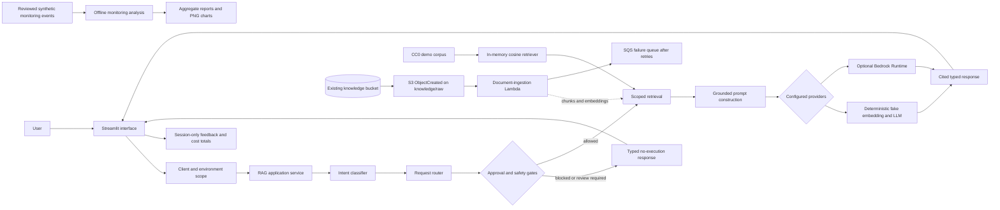
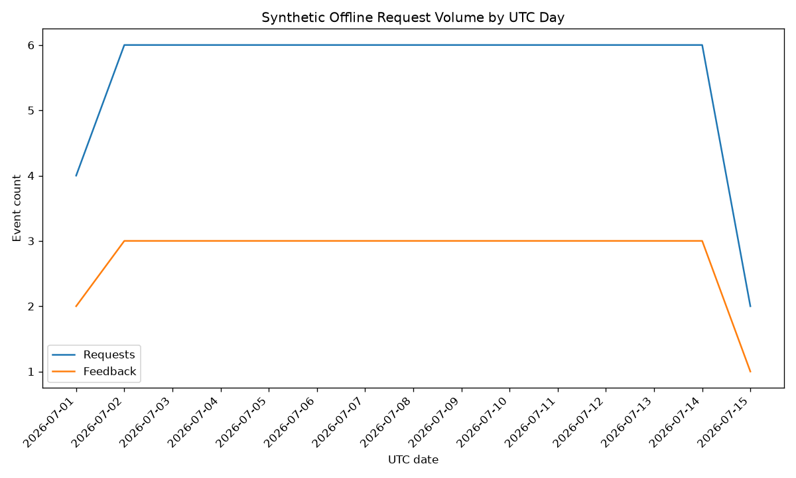
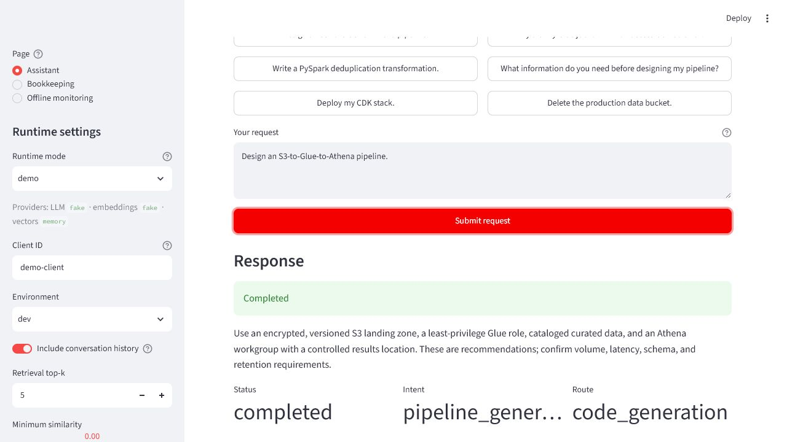
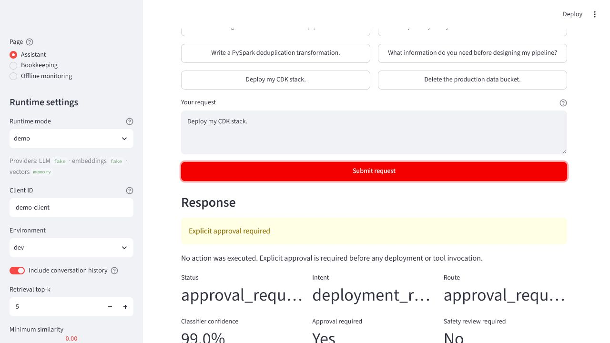

# AWS Data Engineering Assistant

The AWS Data Engineering Assistant is an offline-first, safety-aware RAG
application for answering data-engineering questions and drafting scoped
implementation guidance. It combines a Streamlit interface, deterministic local
providers, client/environment isolation, cited retrieval, request routing,
feedback, and LLM cost estimates. Optional Amazon Bedrock providers and an
existing AWS CDK data foundation are available without making the local demo
depend on AWS.

The default demo makes no network or AWS calls, uses a synthetic CC0 knowledge
corpus, and never executes infrastructure actions. Bedrock mode is explicit and
can incur AWS charges. The application does not include authentication,
persistent conversations, a managed vector database, or a hosted production
service.

## LLM Zoomcamp reviewer quick start

This portfolio project helps data engineers obtain grounded, cited answers to
AWS pipeline design and troubleshooting questions without relying on generic
model knowledge alone. The default demonstration combines a seven-document CC0
corpus with deterministic local embeddings and generation; a separate
36-document CC BY 4.0 AWS pipeline operations dataset supports leakage-safe
retrieval and answer evaluation.

The shortest reviewer path is fully offline:

```powershell
docker compose up --build
```

Open `http://localhost:8501`, select **Assistant**, and try `Why did my Glue
job fail with an access-denied error?`. No AWS account, credentials, production
deployment, external model, or managed vector database is required.

| Zoomcamp evidence | Reviewer entry point |
| --- | --- |
| RAG and retrieval flow | [End-to-end RAG](docs/END_TO_END_RAG.md) |
| Semantic, BM25, and hybrid comparison | [Retrieval evaluation](docs/RETRIEVAL_EVALUATION.md) |
| Three prompt strategies and selection limits | [LLM/prompt evaluation](docs/LLM_AND_PROMPT_EVALUATION.md) |
| Streamlit, feedback, and six-chart monitoring evidence | [Screenshots](docs/images/README.md) and [monitoring](docs/MONITORING_AND_FEEDBACK.md) |
| Exact rubric estimate and evidence map | [LLM Zoomcamp submission map](docs/ZOOMCAMP_SUBMISSION.md) |

The conservative pre-submission estimate is **17/23 non-bonus points** (17/28
including five unclaimed bonus points). Retrieval and prompt evaluation receive
one point each because the measured winners are not silently substituted into
the application default. This is an explicit limitation, not a missing
comparison.

The opt-in production vector-indexing foundation supports lazy Bedrock and
authenticated external Qdrant composition, secret references, private VPC
networking, optimistic manifest writes, and safe redrive operations. It remains
disabled by default and does not provision Qdrant or a credential. See
[Production vector indexing runtime](docs/PRODUCTION_VECTOR_INDEXING_RUNTIME.md).
Runtime availability is distinct from a live integration test. The reviewed,
non-production, dry-run-first procedure is documented in
[Non-production vector indexing validation](docs/NON_PRODUCTION_VECTOR_INDEXING_VALIDATION.md);
it must not be deployed without explicit operator approval.

## Architecture



The diagram distinguishes implemented local runtime paths from optional
application-level S3 storage and Bedrock calls. The CDK stack provisions the
existing data foundation and an optional S3-triggered document-ingestion
runtime; it does not provision a Streamlit host or managed vector store. See
[AWS infrastructure](docs/INFRASTRUCTURE.md) for the exact resource inventory.

## Client scope

`clientId` identifies the organization or workload whose resources and data
must be isolated. An environment identifies the lifecycle stage—`dev`, `test`,
`stage`, or `prod`—within that client. A client can therefore have several
environments, and each client/environment pair receives a distinct stack
identity.

The current named configurations are:

- `internal-dev`, the default internal development configuration.
- `demo-client-dev`, a testing-only example that must never contain real
  customer data.

The configuration registry contains no credentials, secrets, account IDs, or
customer contact information.

Supported Python version: **3.12**. The release container uses
`python:3.12.10-slim`.

## Setup

Create a Python 3.12 virtual environment and install the application and
development dependencies from Windows PowerShell:

```powershell
py -3.12 -m venv .venv
.\.venv\Scripts\Activate.ps1
python -m pip install --upgrade pip
python -m pip install --constraint constraints.txt --requirement requirements.txt --requirement requirements-dev.txt
```

`requirements.txt` and `requirements-dev.txt` are the human-maintained direct
dependency declarations. `constraints.txt` captures the exact full resolution
tested in the Python 3.12.10 Linux release container. Use the constraints file
with the requirements files; do not install it alone. Maintainers should update
it only from a clean Python 3.12 release environment after tests, synth, and the
container build pass.

Without the exact constraints, install the supported ranges with:

```powershell
python -m pip install --requirement requirements.txt --requirement requirements-dev.txt
```

## CDK infrastructure

Synthesize the existing internal development environment:

```powershell
cdk.cmd synth -c client=internal-dev
```

Synthesize the testing-only demo client:

```powershell
cdk.cmd synth -c client=demo-client-dev
```

Direct context can override supported fields when needed, for example:

```powershell
cdk.cmd synth -c client=demo-client-dev -c environment=test
```

One command selects one client configuration; it does not create both clients.
Run local tests with:

```powershell
python -m pytest tests
```

Synth is local; `diff`, deploy, rollback recovery, and destroy have different
credential, cost, and safety implications. Read
[AWS infrastructure](docs/INFRASTRUCTURE.md) before operating on a stack.

## Isolation and compatibility

The existing `internal-dev` deployment keeps its current physical-name formulas.
Changing an existing physical S3 bucket name causes CloudFormation replacement,
so do not apply naming changes to a deployed stack without reviewing a
CloudFormation change set and migration plan. Data buckets retain their existing
retention and cleanup behavior.

The `internal-dev` configuration intentionally keeps the legacy
`DataEngineeringAssistantCdkStack` identity so an existing stack remains an
in-place update target. Non-legacy client configurations use client-specific
stack identities, such as
`DataEngineeringAssistant-Demo-Client-Dev-Stack`.

Every client must eventually have isolated secrets, IAM permissions, logs,
alarms, and data resources. Client data must never be mixed across prefixes,
buckets, Glue databases, logs, or secrets. Separate AWS accounts,
cross-account deployment, automated onboarding, billing, and SLA automation are
intentionally deferred. See [Client isolation foundation](docs/CLIENT_ISOLATION.md).

## Knowledge layer

The Python knowledge layer uses the existing knowledge bucket. The CDK stack
adds a bounded, event-driven runtime for supported documents while
preserving the same object layout:

```text
knowledge/raw/
knowledge/processed/
knowledge/chunks/
knowledge/embeddings/
knowledge/metadata/
```

### Media Storage and Indexing Policy

Every object delivered under `knowledge/raw/` is classified from its normalized
extension, S3 `ContentType`, and practical signature or magic-byte evidence
before extraction. Only approved UTF-8 text formats and PDFs accepted by the
existing PDF text extractor may enter the document pipeline. Pictures, video,
audio, and unsupported binary objects are storage-only: they remain in S3 and
are copied to the client- and environment-scoped
`knowledge/media/{client_id}/{environment}/{media_type}/` hierarchy. Their
metadata may reference the source and storage S3 URIs, but no media bytes are
extracted, chunked, embedded, transcribed, captioned, OCR-processed, sent to an
LLM, written to Qdrant, or exposed through RAG retrieval.

An extension, declared MIME type, or detected signature conflict fails closed.
The object is copied to
`knowledge/quarantine/{client_id}/{environment}/`, a machine-readable rejection
reason is written under `knowledge/metadata/storage-only/`, and a structured
warning is emitted without logging the filename, object key, or content.
Generated media, quarantine, metadata, processed, chunk, and embedding objects
cannot recursively trigger ingestion because the S3 notification remains
limited to the `knowledge/raw/` prefix. The ingestion role has no read grant on
the media or quarantine prefixes.

It provides:

- SHA-256 metadata extraction and upload validation.
- Configurable, document-aware text chunking.
- A JSON document manifest.
- Structured JSON logging for every ingestion step.
- An S3 storage adapter with dependency-injected clients.
- An embedding provider interface with fail-closed automatic indexing.
- An idempotent S3 `ObjectCreated` handler for `knowledge/raw/`.
- Local, page-ordered text extraction for text-based PDFs with `pypdf`.
- Approved bookkeeping-reference classification, client-isolated retrieval,
  grounded prompts, and verified chunk citations.

Example:

```python
from knowledge import (
    KnowledgeIngestionPipeline,
    S3KnowledgeStorage,
)

storage = S3KnowledgeStorage.from_boto3("existing-knowledge-bucket")
pipeline = KnowledgeIngestionPipeline(storage)
entry = pipeline.ingest(
    filename="runbook.md",
    content=b"# Operations runbook",
    source="manual-upload",
)
```

After an explicitly reviewed deployment, uploading a UTF-8 TXT, Markdown,
HTML, JSON, or Python file, or a text-based PDF, under `knowledge/raw/` invokes
the ingestion Lambda. The Lambda creates processed text, chunks, metadata, a
manifest entry, and a per-chunk pending embedding descriptor. The synthesized
stack keeps automatic indexing disabled and has no Bedrock permission; a
reviewed runtime can enable injected provider/store composition. PDFs are
parsed locally with the constrained `pypdf` dependency.
Scanned or image-only PDFs are rejected because OCR is not included, and
password-protected PDFs are rejected because the runtime has no password
source. DOCX parsing remains deferred. The default upload limit is 10 MiB.

Uploading after deployment can incur S3, Lambda, CloudWatch Logs, and SQS
charges:

```powershell
aws s3 cp .\path\runbook.md s3://<knowledge-bucket>/knowledge/raw/runbook.md --region <aws-region>
```

Use placeholders until the target account, Region, bucket, data approval, and
cost implications have been reviewed. See
[Event-driven document ingestion](docs/EVENT_DRIVEN_INGESTION.md) for
idempotency, retries, failure handling, IAM, tests, and deployment guidance.

See [Knowledge layer architecture](docs/KNOWLEDGE_LAYER.md) for the ingestion
flow, schemas, chunking strategy, diagram, and future Bedrock integration.

## Embedding and retrieval

The first Bedrock-ready retrieval increment is implemented without adding
infrastructure:

- `BedrockEmbeddingProvider` uses an injected or boto3-created Amazon Bedrock
  Runtime client with configurable Region and model ID.
- `DeterministicFakeEmbeddingProvider` supplies stable, network-free vectors for
  tests and local development.
- `OllamaEmbeddingProvider` supplies bounded local batch embeddings through the
  existing HTTP provider pattern and defaults to `embeddinggemma`.
- `EmbeddingWorkflow` skips unchanged chunks and re-embeds records when chunk
  checksums or model IDs change.
- Versioned vector records are stored under
  `knowledge/embeddings/{document_id}/`.
- `InMemoryCosineRetriever` provides configurable top-k and similarity
  filtering.
- `VectorStore` adds strictly scoped upsert/retrieval for `InMemoryVectorStore`
  and the optional cosine-backed `QdrantVectorStore`.
- `VectorIndexingWorkflow` consumes existing pending chunk artifacts, retains
  per-chunk progress, skips already indexed chunks, and extends manifests with
  provider, model, store, dimension, status, timestamp, and count fields.
- The S3 event processor automatically invokes an injected indexing workflow
  when configured and routes incomplete reports through its existing retry and
  dead-letter behavior.
- `InMemoryBM25Retriever` provides deterministic, scoped keyword ranking
  without an additional dependency.
- `ReciprocalRankFusionRetriever` combines scoped vector and BM25 rankings
  without comparing incompatible raw scores.
- `RetrievalEvaluator` calculates precision at k, recall at k, and mean
  reciprocal rank.

The reviewed 35-query synthetic benchmark produced:

| Strategy | Precision@1 | Recall@5 | MRR | Hit@5 |
| --- | ---: | ---: | ---: | ---: |
| Semantic vector | 0.4000 | 0.8857 | 0.5948 | 0.8857 |
| BM25 keyword | 0.8571 | 1.0000 | 0.9190 | 1.0000 |
| RRF hybrid | 0.6857 | 1.0000 | 0.8129 | 1.0000 |

BM25 is the recommended default for this small offline corpus, including its
current paraphrase set. The Streamlit runtime remains on its existing semantic
path for backward compatibility; the benchmark does not silently change
application behavior. See
[Retrieval strategy evaluation](docs/RETRIEVAL_EVALUATION.md) for design,
latency, failures, limitations, and reproduction commands.

The independent 36-document AWS pipeline operations dataset is also connected
to the same evaluators through its leakage-safe test split. Its 30 answerable
retrieval queries produced MRR/hit@5 of `0.3372/0.5000` for semantic,
`1.0000/1.0000` for BM25, and `0.7306/0.9333` for hybrid. Six additional
unanswerable queries are preserved and reported separately rather than being
misrepresented in precision/recall metrics. The 18 answer cases compare three
prompt contracts with a deterministic fake provider; grounded evidence-first
was selected, but this is not a claim about real-model quality. Reproduce the
snapshot with:

```powershell
python -m evaluation.run_aws_pipeline_operations_evaluation --split test
```

See [AWS pipeline operations dataset](docs/AWS_PIPELINE_OPERATIONS_DATASET.md)
and the committed [evaluation summary](evaluation/results/aws_pipeline_operations/evaluation_summary.md).

No Bedrock call occurs with the synthesized defaults or during unit tests.
Qdrant is an optional local vector store; no managed vector store is selected
or provisioned. See
[Embedding and retrieval architecture](docs/EMBEDDING_AND_RETRIEVAL.md) for
schemas, incremental behavior, evaluation, security, cost, and deferred
infrastructure decisions.

See [Automatic vector indexing](docs/AUTOMATIC_VECTOR_INDEXING.md) for the
descriptor lifecycle, partial-success recovery, manifest schema, configuration,
client isolation, and architecture diagram.

For the complete host-local RAG flow, including Ollama model setup, Qdrant
Compose startup, explicit document indexing, provider variables, client
isolation, reset procedure, and troubleshooting, see
[Local Ollama and Qdrant RAG](docs/LOCAL_VECTOR_RAG.md).

## Classification and request routing

The provider-neutral request classification layer is separate from embeddings
and retrieval. The current `RuleBasedIntentClassifier` deterministically maps
requests to typed intents. `RequestRouter` then produces a client- and
environment-scoped plan without invoking tools.

Safety is enforced again by the router: deployment actions require explicit
approval, and destructive actions require both approval and safety review.
Explaining or discussing a sensitive action is not authorization to perform it.
A network-free evaluation set covers all supported intents and reports
accuracy, per-intent precision/recall/F1, confusion data, and unknown rate.

`BedrockIntentClassifier` is a non-invoking placeholder for future structured
classification. No permissions, CDK resources, or AWS calls have been added.
See
[Classification and request routing](docs/CLASSIFICATION_AND_ROUTING.md) for
schemas, routing behavior, safety rules, multi-client boundaries, evaluation,
and deferred Bedrock work.

## End-to-end RAG application

`RAGApplicationService` now composes the existing classification, routing,
embedding, and retrieval interfaces with provider-neutral prompt construction
and language-model generation:

```text
request -> classification -> routing -> retrieval when required
        -> grounded prompt -> generation -> attributed response
```

The service receives every provider through dependency injection and never
constructs AWS clients. A deterministic fake LLM supports local and integration
tests. `BedrockLLMProvider` uses the Bedrock Converse API with configurable
Region, model, temperature, token limit, and timeout, but unit tests make no
network calls.

Retrieval results require exact client and environment metadata matches before
they reach a prompt. Results are thresholded, deduplicated, context-limited,
and returned as typed source citations independently of model-authored
citations.

Deployment and destructive routes return immediately without model, retrieval,
or tool execution. Missing scoped evidence produces a typed
`insufficient_context` response instead of a fabricated answer. Conversation
context is bounded and request-local; persistence remains deferred.

See [End-to-end RAG application](docs/END_TO_END_RAG.md) for the Mermaid
architecture, request and response schemas, route behavior, prompt rules,
Bedrock configuration, attribution, evaluation, current Streamlit integration,
limitations, and deferred API or persistent-monitoring work.

## Offline LLM and prompt comparison

The reproducible prompt evaluation holds fixed retrieved context constant and
compares three versioned strategies in concise and detailed deterministic fake
LLM modes. It measures orchestration, formatting, grounding, uncertainty, and
safety behavior; it does not claim to measure real model quality.

| Strategy | Overall quality | Complete citations | Complete answers | Avg total tokens | Simulated avg USD |
| --- | ---: | ---: | ---: | ---: | ---: |
| Baseline concise | 0.9028 | 0.7333 | 0.2333 | 247.5 | 0.00007564166666666666666666666667 |
| Grounded evidence-first | 1.0000 | 1.0000 | 1.0000 | 285.9 | 0.0001010416666666666666666666667 |
| Structured troubleshooting | 0.9722 | 1.0000 | 0.6667 | 289.2 | 0.0001081875 |

The evidence-first strategy is the offline recommendation, with higher token
use than the baseline. The production `GroundedPromptBuilder` remains
unchanged pending real-model and human review. Costs use a synthetic Decimal
pricing profile and incurred no provider charge. See
[LLM and prompt evaluation](docs/LLM_AND_PROMPT_EVALUATION.md) for scoring,
failure analysis, limitations, and reproduction commands.

## Offline monitoring and feedback analysis

A provider-neutral event schema and append-only local JSONL sink support
reproducible monitoring analysis without production infrastructure. The
reviewed CC0 fixture contains 275 events across 84 requests and two fictional
client/environment scopes. Streamlit's **Offline monitoring** page reads only
this committed synthetic evidence.

| Metric | Synthetic result |
| --- | ---: |
| Request success | 95.2% |
| Grounded responses | 98.2% |
| Complete citations | 87.5% |
| No-result retrieval | 9.7% |
| Positive feedback | 73.8% |
| Application errors | 4.8% |
| Simulated total cost | $0.02452375 |



All charts are labeled synthetic and illustrate aggregation rather than real
service levels or user behavior. Reports omit raw feedback, prompts, queries,
document text, and credentials. Local event files are ignored by Git and
excluded from the Docker build context; the reviewed fixture is stored under
`evaluation/fixtures`. See
[Monitoring and feedback analysis](docs/MONITORING_AND_FEEDBACK.md).

## LLM request cost estimates

Every generated response can carry a provider-neutral `CostEstimate`. Bedrock
mode uses only the Converse API's authoritative input/output token counts and a
versioned, Region-aware local price catalog. Unknown models, unknown Regions,
or missing provider usage produce a clear unavailable estimate without failing
the answer or fabricating token counts.

Demo mode always displays `$0.000000` and
`Demo mode — no Bedrock charge incurred`. Streamlit also shows component rates
and costs, catalog provenance, and request-ID-deduplicated session totals.
Feedback JSON/CSV and structured logs include non-sensitive aggregate cost
metadata.

Pricing is an application estimate, not an AWS invoice. Maintainers must
validate the catalog against the
[official Amazon Bedrock pricing page](https://aws.amazon.com/bedrock/pricing/)
before releases. See [LLM cost estimation](docs/COST_ESTIMATION.md) for the
Decimal formulas, catalog schema, cache handling, operational limitations, and
deferred billing integration.

## Local Streamlit interface

The project includes an offline-first Streamlit interface for development and
demonstration. It calls `RAGApplicationService` rather than duplicating
classification, routing, retrieval, prompt, or safety logic.

The screenshots below were captured from the real offline application on
2026-08-06. They contain only the synthetic demo corpus and no provider,
credential, customer, or deployment data. The remaining Docker health capture
is tracked in [docs/images/README.md](docs/images/README.md).





Install dependencies and launch on Windows PowerShell:

```powershell
.\.venv\Scripts\Activate.ps1
python -m pip install --constraint constraints.txt --requirement requirements.txt
python -m streamlit run ui/app.py
```

Demo mode is the default. It makes no AWS calls and loads a deterministic,
synthetic CC0 corpus covering S3, Glue, Athena, IAM, PySpark, monitoring, and
cost awareness.

To enable Bedrock mode, configure AWS credentials outside the UI and set
environment variables before launch:

```powershell
$env:APP_RUNTIME_MODE = "bedrock"
$env:AWS_REGION = "us-west-2"
$env:APP_EMBEDDING_MODEL_ID = "amazon.titan-embed-text-v2:0"
$env:APP_LLM_MODEL_ID = "anthropic.claude-3-haiku-20240307-v1:0"
python -m streamlit run ui/app.py
```

Bedrock mode may incur AWS cost. The interface never asks for or displays
credentials.

Supported settings are:

- `APP_RUNTIME_MODE`
- `APP_LLM_PROVIDER` / `LLM_PROVIDER`
- `APP_EMBEDDING_PROVIDER` / `EMBEDDING_PROVIDER`
- `APP_VECTOR_STORE_PROVIDER` / `VECTOR_STORE_PROVIDER`
- `AWS_REGION`
- `APP_EMBEDDING_MODEL_ID`
- `APP_LLM_MODEL_ID`
- `APP_DEFAULT_CLIENT_ID`
- `APP_DEFAULT_ENVIRONMENT`
- `APP_RETRIEVAL_TOP_K`
- `APP_MINIMUM_SIMILARITY`
- `APP_MAXIMUM_CONVERSATION_MESSAGES`
- `APP_DEVELOPER_MODE`
- `APP_PRICING_CATALOG_PATH` (optional reviewed local JSON catalog)
- `APP_OLLAMA_URL`, `APP_OLLAMA_EMBEDDING_MODEL`, `APP_OLLAMA_CHAT_MODEL`
- `APP_QDRANT_URL`, `APP_QDRANT_COLLECTION`, `APP_QDRANT_API_KEY` (optional)

Example questions include:

- `Design an S3-to-Glue-to-Athena pipeline.`
- `Why did my Glue job fail with an access-denied error?`
- `Write a PySpark deduplication transformation.`
- `What information do you need before designing my pipeline?`
- `Deploy my CDK stack.`
- `Delete the production data bucket.`

The final two demonstrate approval and destructive-action safety without
executing anything. Conversation and feedback remain only in Streamlit session
state. One thumbs-up or thumbs-down rating plus an optional comment can be
recorded per completed request and exported locally as JSON or CSV.

### Private bookkeeping analysis

The **Bookkeeping** page accepts a bounded local CSV export and provides
row-level validation, normalized previews, reproducible `Decimal` totals,
monthly/category/account summaries, explainable duplicate candidates, and
uncategorized review. A reviewed synthetic example is available at
[`data/bookkeeping/sample_transactions.csv`](data/bookkeeping/sample_transactions.csv).

Model actions are separate from financial calculations. They require an
explicit approval and click, send only limited fields, and produce advisory
output requiring human review. The local Ollama provider defaults to
`http://localhost:11434` and `gpt-oss:20b`; it never silently falls back to
Bedrock. No upload, QuickBooks connection, transaction modification, or AWS
resource is part of this phase.

```powershell
ollama list
ollama run gpt-oss:20b
$env:DEA_LLM_PROVIDER = "ollama"
$env:DEA_OLLAMA_MODEL = "gpt-oss:20b"
python -m streamlit run ui/app.py
```

See [Private bookkeeping assistant](docs/BOOKKEEPING_ASSISTANT.md) for CSV
headings, the amount sign convention, privacy boundaries, configuration, and
the deterministic-versus-LLM design.

See [Local Streamlit interface](docs/STREAMLIT_INTERFACE.md) for architecture,
configuration, source presentation, error handling, demo licensing, Zoomcamp
alignment, and known limitations.

## Docker

Prerequisites are Docker Desktop or another Docker Engine with Compose v2.
Build and run the offline demo from Windows PowerShell:

```powershell
docker build -t data-engineering-assistant .
docker run --rm -p 8501:8501 data-engineering-assistant
```

Or use Compose:

```powershell
docker compose up --build
```

Start only the optional loopback-bound Qdrant service with persistent local
storage:

```powershell
docker compose up -d qdrant
```

Open `http://localhost:8501`. The default image and Compose service set
`APP_RUNTIME_MODE=demo`; they require no AWS account, credentials, S3,
Bedrock, database, or managed vector store.

Bedrock is explicit and may incur AWS charges. Standard boto3 credentials must
be supplied from outside the image through short-lived environment variables
or a reviewed read-only AWS profile mount. No credential is stored in
`compose.yaml`.

Container environment variables are:

- `APP_RUNTIME_MODE`
- `AWS_REGION`
- `APP_EMBEDDING_MODEL_ID`
- `APP_LLM_MODEL_ID`
- `APP_DEFAULT_CLIENT_ID`
- `APP_DEFAULT_ENVIRONMENT`
- `APP_RETRIEVAL_TOP_K`
- `APP_MINIMUM_SIMILARITY`
- `APP_MAXIMUM_CONVERSATION_MESSAGES`
- `APP_DEVELOPER_MODE`
- `APP_PRICING_CATALOG_PATH`
- `APP_PORT`
- `BEDROCK_APP_PORT`

If port 8501 is occupied:

```powershell
$env:APP_PORT = "8502"
docker compose up --build
```

Inspect container health and logs with:

```powershell
docker compose ps demo
docker compose logs demo
```

See [Containerization](docs/CONTAINERIZATION.md) for the Bedrock profile,
credential mechanisms, health checks, security decisions, troubleshooting, and
Zoomcamp alignment.

## Project directory overview

```text
config/                         client/environment configuration
bookkeeping/                    local CSV, analytics, duplicate, and report services
data/bookkeeping/               reviewed synthetic transaction and reference fixtures
data/aws_pipeline_operations/   36-document CC BY 4.0 evaluation dataset
data/monitoring/                ignored local JSONL event storage
data_engineering_assistant_cdk/ existing AWS CDK stack
knowledge/                      ingestion, retrieval, routing, and RAG services
evaluation/                     synthetic fixtures, runners, and evidence snapshots
lambda/                         health-check and document-ingestion handlers
ui/                             Streamlit UI and synthetic demo corpus
tests/                          offline unit and integration-style tests
docs/                           architecture and operating documentation
.github/workflows/ci.yml        offline validation workflow
Dockerfile                      non-root Streamlit image
compose.yaml                    demo default and Bedrock opt-in profile
constraints.txt                 tested Python 3.12 dependency resolution
LICENSE                         MIT license
```

## Documentation

- [AWS infrastructure](docs/INFRASTRUCTURE.md)
- [Client isolation foundation](docs/CLIENT_ISOLATION.md)
- [Knowledge layer](docs/KNOWLEDGE_LAYER.md)
- [Event-driven document ingestion](docs/EVENT_DRIVEN_INGESTION.md)
- [Embedding and retrieval](docs/EMBEDDING_AND_RETRIEVAL.md)
- [Local Ollama and Qdrant RAG](docs/LOCAL_VECTOR_RAG.md)
- [Non-production vector indexing validation](docs/NON_PRODUCTION_VECTOR_INDEXING_VALIDATION.md)
- [External Qdrant integration contract](docs/QDRANT_INTEGRATION_CONTRACT.md)
- [AWS pipeline operations dataset](docs/AWS_PIPELINE_OPERATIONS_DATASET.md)
- [Retrieval strategy evaluation](docs/RETRIEVAL_EVALUATION.md)
- [LLM and prompt evaluation](docs/LLM_AND_PROMPT_EVALUATION.md)
- [Monitoring and feedback analysis](docs/MONITORING_AND_FEEDBACK.md)
- [Private bookkeeping assistant](docs/BOOKKEEPING_ASSISTANT.md)
- [Fresh-clone release verification](docs/FRESH_CLONE_VERIFICATION.md)
- [Classification and routing](docs/CLASSIFICATION_AND_ROUTING.md)
- [End-to-end RAG](docs/END_TO_END_RAG.md)
- [Streamlit interface](docs/STREAMLIT_INTERFACE.md)
- [Containerization](docs/CONTAINERIZATION.md)
- [Cost estimation](docs/COST_ESTIMATION.md)
- [LLM Zoomcamp submission map](docs/ZOOMCAMP_SUBMISSION.md)
- [Security policy](SECURITY.md)

## Public release checklist

- [x] MIT, CC0 demo/benchmark, and CC BY 4.0 dataset boundaries
- [x] Python 3.12 dependency ranges and tested exact constraints
- [x] Offline tests, CDK synth, whitespace check, and Docker build in CI
- [x] Architecture and subsystem documentation
- [x] Synthetic example questions and deterministic offline demo
- [x] Security reporting policy with no fabricated contact address
- [ ] Enable GitHub private vulnerability reporting
- [x] Capture and review the offline UI screenshots in
  [docs/images/README.md](docs/images/README.md)
- [ ] Capture Docker health after Docker Desktop is running
- [x] Publish semantic, keyword, and hybrid retrieval comparison results
- [x] Evaluate the leakage-safe AWS operations test split
- [x] Publish LLM/prompt comparison results
- [x] Add monitoring/feedback charts using synthetic or redacted data
- [ ] Record a setup and application walkthrough
- [ ] Confirm a successful workflow run from a fresh public clone
- [ ] Revalidate the Bedrock price catalog before any Bedrock demonstration
- [x] Review the current Zoomcamp rubric and submission links

## Useful commands

- `cdk.cmd ls` lists stacks in the app.
- `cdk.cmd synth -c client=internal-dev` emits the legacy-compatible template.
- `python -m pytest tests` runs repository-owned tests without AWS calls.
- `python -m evaluation.run_retrieval_comparison` regenerates retrieval evidence.
- `python -m evaluation.run_aws_pipeline_operations_evaluation --split test`
  regenerates the larger corpus evaluation evidence.
- `python -m evaluation.run_llm_prompt_comparison` regenerates prompt evidence.
- `python -m evaluation.generate_monitoring_fixture` verifies the reviewed
  monitoring fixture; add `--force` to regenerate it intentionally.
- `python -m evaluation.run_monitoring_report` regenerates monitoring evidence.
- `python -m streamlit run ui/app.py` launches the offline demo.
- `docker compose up --build` builds and launches the Compose demo.

## License

Application code and project documentation are available under the
[MIT License](LICENSE). The seven synthetic demo-corpus documents and
evaluation benchmark and monitoring fixture data have explicit CC0 1.0
boundaries described in
[ui/demo_corpus/README.md](ui/demo_corpus/README.md) and
[evaluation/benchmark/README.md](evaluation/benchmark/README.md), and
[evaluation/fixtures/README.md](evaluation/fixtures/README.md). Local
monitoring storage guidance is in
[data/monitoring/README.md](data/monitoring/README.md). Dependencies and
third-party names retain their own licenses and rights. The 36-document AWS
pipeline operations dataset is synthetic and licensed CC BY 4.0 as documented
in [docs/AWS_PIPELINE_OPERATIONS_DATASET.md](docs/AWS_PIPELINE_OPERATIONS_DATASET.md).
