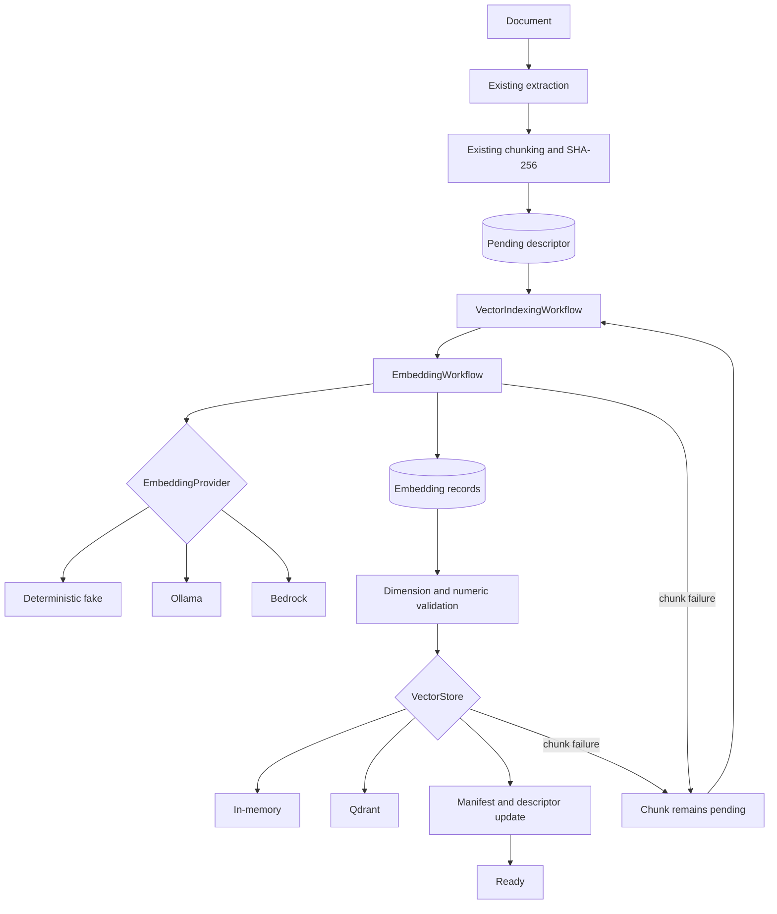

# Automatic vector indexing

## Purpose

Automatic indexing completes the existing knowledge pipeline without moving
provider logic into extraction or ingestion. `KnowledgeIngestionPipeline`
still preserves the source, extracts text, chunks it, and writes a pending
descriptor. `VectorIndexingWorkflow` is the reusable indexing service that
consumes that persisted boundary.

The S3 event processor accepts the service through dependency injection. When
automatic indexing is enabled, a successful upload is not reported complete
until every chunk is indexed. An incomplete report enters the Lambda event's
existing asynchronous retry and dead-letter path. Automatic indexing is
disabled in the synthesized stack until a durable vector endpoint, networking,
credentials, and model permissions have been reviewed for that environment.

## Architecture



The service depends only on `EmbeddingWorkflow` and `VectorStore`. Provider and
store selection occurs once in `build_automatic_indexing_workflow`; future
implementations can satisfy the same contracts without changing orchestration.

## Descriptor and manifest lifecycle

New pending descriptors use schema version 2 and contain one state record per
chunk. Each state stores only its chunk ID, canonical chunk checksum, status,
attempt count, safe error type, and indexing timestamp. Existing descriptors
with the original `{document_id, provider, status, vectors}` shape are accepted
and upgraded on their first indexing run.

Chunk states are:

- `pending`: the chunk has not been durably accepted by the configured store;
- `indexed`: the vector store accepted the chunk and the descriptor recorded
  the success.

A failed chunk remains `pending`; `last_error_type` distinguishes a current
failure from work that has never been attempted. The manifest extends its
existing document entry with:

| Field | Meaning |
| --- | --- |
| `indexed_at` | UTC time the complete document became ready |
| `embedding_model` | Stable configured model ID |
| `embedding_provider` | Stable provider name |
| `vector_store` | Stable vector-store provider name |
| `vector_dimension` | Validated dimension shared by current vectors |
| `index_status` | `pending`, `partial`, `failed`, or `complete` |
| `indexed_chunk_count` | Current indexed chunks |
| `pending_chunk_count` | Current non-indexed chunks, including failures |
| `failed_chunk_count` | Pending chunks that failed the latest attempt |

The established `vector_status`, `vector_store_provider`, and
`vector_collection` fields remain populated for compatible readers. Repeated
ingestion with the same document ID and checksum preserves extended state.

## Idempotency and retries

The existing chunk-text SHA-256 and model ID decide whether an embedding record
is current. Embedding provider identity is now stored as well, preventing two
providers that happen to use the same model label from sharing an incompatible
record.

An indexed descriptor chunk is not embedded or upserted again when its client,
environment, namespace, domain, embedding provider/model, vector store, and
checksum are unchanged. A provider, model, store, namespace, or domain change
returns affected chunks to pending. A client or environment mismatch is
rejected instead of copying data across a scope.

Embedding and vector-store operations advance independently per chunk. If one
chunk fails, successful chunks are persisted as indexed and are skipped by the
next run. A retry processes only pending chunks. Qdrant's deterministic point
IDs include client, environment, namespace, domain, document, chunk, checksum,
and embedding model. The in-memory store's document/chunk keys provide an
additional idempotency layer if the process stops after a store upsert but
before state is persisted.

## Client isolation and metadata

`client_id` and `environment` are normalized before descriptor, embedding, or
vector-store work. Missing client metadata fails before a provider call. A
descriptor already assigned to another client or environment cannot be reused.

Every `RetrievalEntry` and Qdrant payload preserves these fields:

- `client_id` and `environment`;
- `namespace` and `knowledge_namespace`;
- `domain` and `knowledge_domain`;
- `document_id`, `document_type`, `source`, and `checksum`.

The vector stores retain their mandatory client/environment validation and
database-side retrieval filters. Caller metadata cannot override protected
scope or document fields. Bookkeeping's separately implemented rule—matching
client references plus explicitly approved general references—does not change.

## Failure behavior and statistics

Provider failures, malformed vectors, inconsistent dimensions, and vector-store
failures produce sanitized chunk failures with `chunk_id`, stage, and exception
type. Exception messages, text, prompts, vectors, secrets, and financial data
are not logged. The document report includes total, newly indexed, already
indexed, current indexed, pending, failed, created-embedding, and skipped-
embedding counts. Queue reports aggregate the same durable state; an empty
queue returns zero counts without invoking a provider or store.

Storage or malformed-artifact errors raise because the service cannot safely
claim that progress was persisted. Provider and vector-store failures return a
detailed incomplete report after state updates. The S3 event adapter converts
that report into a typed retryable failure.

## Configuration and provider selection

Automatic indexing is fail-closed:

```text
KNOWLEDGE_AUTOMATIC_INDEXING_ENABLED=false
KNOWLEDGE_EMBEDDING_PROVIDER=fake|ollama|bedrock
KNOWLEDGE_VECTOR_STORE_PROVIDER=memory|qdrant
KNOWLEDGE_EMBEDDING_MODEL_ID=amazon.titan-embed-text-v2:0
KNOWLEDGE_EMBEDDING_BATCH_SIZE=8
KNOWLEDGE_EMBEDDING_DIMENSIONS=
KNOWLEDGE_NAMESPACE=data-engineering
KNOWLEDGE_DOMAIN=general
```

Ollama settings are `KNOWLEDGE_OLLAMA_URL` and
`KNOWLEDGE_OLLAMA_EMBEDDING_MODEL`. Qdrant settings are
`KNOWLEDGE_QDRANT_URL`, `KNOWLEDGE_QDRANT_COLLECTION`, and, for local-only
compatibility, an optional programmatically supplied API key. Production uses
`KNOWLEDGE_QDRANT_SECRET_IDENTIFIER`; plaintext production credentials are
rejected. Bedrock uses `AWS_REGION` and
`KNOWLEDGE_EMBEDDING_MODEL_ID`.

Enabling automatic indexing requires explicit provider and store names.
`fake`/`memory` are deterministic offline options and are not durable production
storage. `ollama`/`qdrant` remain explicit local options; configuring them does
not start services or download models. Bedrock selection constructs the
existing provider and never falls back to another provider.

Before enabling the synthesized Lambda, package the selected provider's runtime
dependencies and review its network route, secret delivery, timeout, vector
store durability, and least-privilege model permission. The current stack keeps
the switch off and grants no Bedrock invocation permission unless the complete
production context is explicitly supplied. Aggregate manifest writes use ETag
preconditions with bounded re-read and reconciliation. Reserved concurrency is
optional and is omitted for environments, including internal-dev, whose quota
cannot safely support a reservation.

## Local PowerShell verification

These checks do not contact AWS, Bedrock, Ollama, or Qdrant:

```powershell
Set-Location <repository-root>
py -3.12 -m compileall .
py -3.12 -m pytest
git diff --check
npx --yes aws-cdk@2.1133.0 synth -c client=internal-dev --quiet
```

An explicit local Ollama/Qdrant run remains documented in
[Local Ollama and Qdrant RAG](LOCAL_VECTOR_RAG.md); it is not part of offline
validation.

A live AWS/Qdrant integration is a separate, explicitly approved milestone.
Use the offline preflight, fixture, evidence contract, layer inspection, and
phase-separated procedure in
[Non-production vector indexing validation](NON_PRODUCTION_VECTOR_INDEXING_VALIDATION.md).
