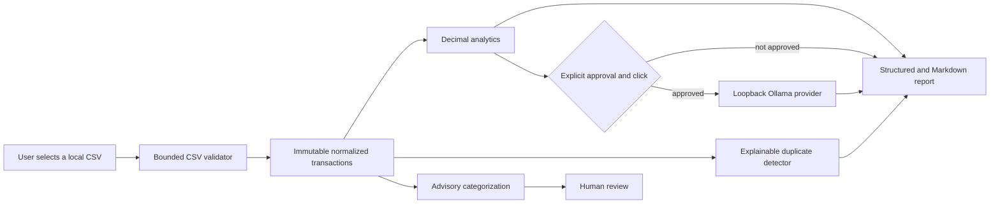

# Private bookkeeping assistant

The first bookkeeping phase adds local CSV validation, deterministic business
analysis, explainable duplicate detection, advisory categorization, and an
optional AI-written summary to the existing Streamlit application. It adds no
AWS resources and performs no transaction writes.

This capability is for review and business insight. It is not accounting, tax,
legal, or financial advice.

## Architecture and trust boundary



The CSV is held in the current Streamlit session. It is not copied to S3,
QuickBooks, Bedrock, a database, or local server storage. Deterministic
calculations never call an LLM. The model cannot change totals, categories, or
source transactions.

The current controls are:

- immutable normalized transaction records;
- `Decimal` for every monetary calculation;
- bounded uploads and row counts;
- row-level errors that omit source values;
- no raw financial-data logging;
- loopback-only Ollama URLs;
- no automatic provider calls or provider fallback;
- explicit approval before descriptions and amounts are sent to a model;
- suggestions marked for human review;
- no automatic merge, deletion, or category overwrite;
- spreadsheet-formula protection in downloaded normalized CSV files.

## Start Ollama on Windows

Install Ollama separately, then verify the configured model from PowerShell:

```powershell
ollama list
ollama run gpt-oss:20b
```

In a second PowerShell window, activate this project's Python environment and
select Ollama:

```powershell
.\.venv\Scripts\Activate.ps1
$env:DEA_LLM_PROVIDER = "ollama"
$env:DEA_OLLAMA_BASE_URL = "http://localhost:11434"
$env:DEA_OLLAMA_MODEL = "gpt-oss:20b"
$env:DEA_OLLAMA_TIMEOUT_SECONDS = "120"
python -m streamlit run ui/app.py
```

Open the **Bookkeeping** page. Uploading a file runs only local validation and
deterministic calculations. Ollama is contacted only after the approval
checkbox is selected and a model action button is clicked. Tests use mocks and
do not require Ollama.

The provider uses Ollama's local `/api/chat` endpoint with non-streaming
responses, disabled thinking output, deterministic temperature, and an
optional JSON schema for categorization. Base URLs must use
`localhost`, `127.0.0.1`, or `::1` with an explicit port.

References: [Ollama chat API](https://docs.ollama.com/api/chat),
[structured outputs](https://docs.ollama.com/capabilities/structured-outputs),
and the [`gpt-oss:20b` model page](https://ollama.com/library/gpt-oss%3A20b).

## Configuration

| Variable | Default | Purpose |
| --- | --- | --- |
| `DEA_LLM_PROVIDER` | `fake` | Explicit `fake`, `ollama`, or `bedrock` selection |
| `DEA_OLLAMA_BASE_URL` | `http://localhost:11434` | Loopback Ollama service |
| `DEA_OLLAMA_MODEL` | `gpt-oss:20b` | Local model name |
| `DEA_OLLAMA_CONNECT_TIMEOUT_SECONDS` | `5` | Connection timeout |
| `DEA_OLLAMA_TIMEOUT_SECONDS` | `120` | Read timeout |
| `DEA_BOOKKEEPING_MAX_UPLOAD_BYTES` | `5242880` | CSV byte limit |
| `DEA_BOOKKEEPING_MAX_ROWS` | `10000` | Data-row limit |
| `DEA_BOOKKEEPING_CATEGORY_BATCH_SIZE` | `25` | Advisory request batch size |
| `DEA_BOOKKEEPING_DUPLICATE_WINDOW_DAYS` | `3` | Near-date duplicate window |
| `DEA_BOOKKEEPING_KNOWLEDGE_MAX_PASSAGES` | `5` | Maximum passages per grounded request |
| `DEA_BOOKKEEPING_KNOWLEDGE_MAX_CONTEXT_CHARACTERS` | `12000` | Total retrieved-text limit |
| `DEA_BOOKKEEPING_KNOWLEDGE_CHUNK_SIZE` | `1000` | Per-page character chunk size |
| `DEA_BOOKKEEPING_KNOWLEDGE_CHUNK_OVERLAP` | `100` | Per-page character overlap |

`fake` is the offline default. `bedrock` remains part of the repository's
provider factory for compatibility and injected tests, but the bookkeeping UI
intentionally disables it in this local financial-data phase. There is no
silent fallback to Bedrock.

## Expected CSV format

The minimum data is a date, a description-like field, and either an amount or
debit/credit columns. Heading matching ignores case, spaces, hyphens, and
common punctuation.

Recognized headings include:

- date: `date`, `transaction_date`, `posted_date`;
- description: `description`, `memo`, `payee`, `vendor`;
- money: `amount`, or separate `debit` and `credit`;
- optional context: `transaction_id`, `id`, `account`, `category`, `memo`,
  `vendor`, and `payee`.

Supported dates include ISO `YYYY-MM-DD`, common US numeric dates, and English
month-name dates. Amounts may include commas, a supported currency symbol or
code, a sign, or accounting parentheses.

The normalized sign convention is:

- positive amount = income or cash inflow;
- negative amount = expense or cash outflow.

With separate columns, credit becomes a positive amount and debit becomes a
negative amount. A row with nonzero values in both columns is rejected rather
than guessed. See
[`data/bookkeeping/sample_transactions.csv`](../data/bookkeeping/sample_transactions.csv)
for reviewed synthetic data.

## Deterministic and AI responsibilities

Normal Python services calculate income, expense magnitudes, net cash flow,
signed averages, monthly summaries, category/account totals, largest expenses,
and uncategorized expense percentage. Duplicate rules are deterministic and
explain their evidence and confidence.

The model receives only a row reference, description, and amount for category
suggestions. Report explanations receive aggregates and safe row references,
not descriptions, account names, memos, transaction IDs, or the original CSV.
Responses are advisory, validated, and clearly labeled. Invalid or unavailable
categorization responses use deterministic keyword suggestions; existing
categories are never replaced.

## Privacy limitations

Local processing reduces data movement but does not make a shared Streamlit
server a secure multi-user accounting product. The uploaded bytes and derived
rows exist in process and browser-session memory. The normalized CSV and
Markdown buttons initiate browser downloads, so the user controls their
destination.

Do not upload real data on an untrusted workstation. Review terminal output,
browser downloads, backups, endpoint protection, and local Ollama retention
policies for the intended environment. Local private exports should go under
`data/bookkeeping/local/` or use the `.private.csv` suffix; both are ignored by
Git.

## Why QuickBooks is deferred

QuickBooks access introduces OAuth token storage, tenant mapping, accounting
object semantics, rate limits, audit logs, permissions, reconciliation, and
high-risk write operations. Those controls require a separate design and
security review. This phase has no QuickBooks client and no read or write path.

## Tests

Run all tests from Windows PowerShell:

```powershell
.\.venv\Scripts\Activate.ps1
python -m compileall bookkeeping knowledge ui tests
python -m pytest
```

The test suite mocks local HTTP calls and injects any Bedrock client. It does
not contact Ollama, AWS, or a user's transaction files.

## Bookkeeping RAG references

The bookkeeping assistant now has two deliberately different capability
sources:

- **Model skills** are general patterns learned by the selected model. They can
  be incomplete or wrong and do not contain this business's approved policy.
- **Retrieved context** is a small set of relevant passages selected from
  explicitly approved, uploaded bookkeeping PDFs. It is supplied as untrusted
  reference data and is cited by the answer.

This is retrieval-augmented generation (RAG), not training or fine-tuning. An
uploaded PDF does not change the model. It becomes eligible for retrieval only
after a user selects **Approved for bookkeeping context** and supplies valid
classification metadata.

Supported bookkeeping document types are:

- `accounting_reference`
- `bookkeeping_procedure`
- `chart_of_accounts`
- `categorization_policy`
- `client_policy`
- `software_documentation`

The approval record also includes a title, source filename, an explicit
client-specific/general choice, optional client ID, optional effective and
review dates, optional authority level, and active status. The original PDF
extraction metadata is preserved separately. Document text is never copied into
classification metadata.

### Client isolation and lifecycle

A client-specific reference requires a normalized client ID. Retrieval for one
client includes that client's active approved references plus active approved
general references. It never includes a different client's references. A
general reference must be explicitly marked non-client-specific and cannot
carry a client ID. An approved reference can be deactivated in Streamlit; this
excludes it from future retrieval without deleting its session-local content.

The current Streamlit catalog is held only in the browser's server-side
session. It disappears when the session or process ends. The production S3
ingestion pipeline remains intact and is not contacted by this local workflow.

### Upload a text-based PDF

1. Open **Bookkeeping** and locate **Bookkeeping knowledge**.
2. Choose a text-based PDF and enter its title and document type.
3. Explicitly choose whether it is client-specific. Supply the matching client
   ID when it is.
4. Optionally enter effective/review dates and an authority level.
5. Select **Approved for bookkeeping context**.
6. Click **Ingest approved reference**.

Ingestion reuses the existing local `pypdf` extractor, page-aware use of the
existing text chunker, the embedding-provider contract, manifest models, and
retriever implementations. Uploading performs no LLM call. Scanned and
image-only PDFs are unsupported because OCR is intentionally absent. Encrypted,
malformed, oversized, or path-like filenames are rejected with safe errors.

### Retrieval and citations

The page supports keyword, semantic, and hybrid retrieval. Keyword uses the
existing BM25 implementation. Semantic uses the existing embedding and cosine
interfaces. Hybrid uses the existing reciprocal-rank-fusion retriever. The
local Streamlit catalog uses deterministic local embeddings; it does not call
Bedrock.

Every displayed citation maps directly to a retrieved chunk:

```text
[1] Fictional transaction policy — page 2 — chunk abc123:000004
```

Page is omitted when it is not verified. Citations include only the document
title, source filename in structured result data, page when available, chunk
ID, and retrieval score. A deterministic validator blocks model-generated
citation IDs that were not in the retrieval result. The app never invents a
page number or citation.

### How an accounting book is used

An approved accounting book can supply definitions and general bookkeeping
principles for an explanation. It is supporting context, not an authority for a
specific business decision. A general book alone is not enough: it normally
does not define the business's chart of accounts, owner-equity conventions,
documentation rules, software workflow, effective dates, or reviewer-approved
exceptions. Pair general references with reviewed business-specific policy.

Recommended reference set:

- bookkeeping fundamentals;
- the approved chart of accounts;
- a business-specific categorization policy;
- internal bookkeeping and duplicate-review procedures;
- approved software documentation.

The repository includes only small original fictional examples under
`data/bookkeeping/references/`. They are not accounting or tax advice and are
not automatically ingested or approved.

### Deterministic analytics versus explanations

CSV normalization, income, expenses, net cash flow, monthly totals, category
and account summaries, largest expenses, uncategorized percentages, and
duplicate candidates remain deterministic and Decimal-based. Retrieved text
and model output cannot mutate these values. Category suggestions remain
advisory, existing categories are never overwritten, and no category is
automatically approved.

On an explicitly approved action, categorization can retrieve relevant policy
passages before invoking the selected model. Supporting citations are validated
and attached to suggestions. Conflicting policy statements are flagged for
human review. If no relevant approved policy is found, the result states that
it is based only on the configured category list and model reasoning; the
deterministic fallback remains available.

The business report separates:

A. deterministic calculations;
B. AI-generated explanation;
C. reference guidance;
D. citations; and
E. items requiring human review.

### Prompt-injection protection

Retrieved PDF text is treated as untrusted data. Prompts place every passage
inside explicit `BEGIN_UNTRUSTED_REFERENCE` and `END_UNTRUSTED_REFERENCE`
boundaries and instruct the model to ignore commands, role changes, tool
requests, or system-prompt text inside a document. Only bounded retrieved
passages are sent, never a full PDF or full set of books. Long numeric account
identifiers are redacted from returned passages. Logs contain operational
metadata only—document/client identifiers, retrieval mode, chunk count,
latency, provider, and typed outcome—not PDF text, transaction descriptions,
account numbers, memos, full prompts, or full responses.

These defenses reduce risk but do not make untrusted documents safe or model
output authoritative. Review every source and answer. The output is not
accounting, tax, legal, audit, or CPA advice.

## Exact Windows PowerShell workflow

From this repository's current path:

```powershell
Set-Location <repository-root>
.\.venv\Scripts\Activate.ps1
```

To use Ollama, start or verify it in one PowerShell window:

```powershell
ollama list
ollama run gpt-oss:20b
```

Then launch the Streamlit entry point in another window:

```powershell
Set-Location <repository-root>
.\.venv\Scripts\Activate.ps1
$env:DEA_LLM_PROVIDER = "ollama"
$env:DEA_OLLAMA_BASE_URL = "http://localhost:11434"
$env:DEA_OLLAMA_MODEL = "gpt-oss:20b"
python -m streamlit run ui/app.py
```

Ollama is contacted only after the per-action approval box is selected and a
generation button is clicked. There is no hidden fallback to Bedrock.

Run offline verification with:

```powershell
Set-Location <repository-root>
.\.venv\Scripts\Activate.ps1
python -m compileall bookkeeping knowledge ui tests
python -m pytest
git diff --check
```
