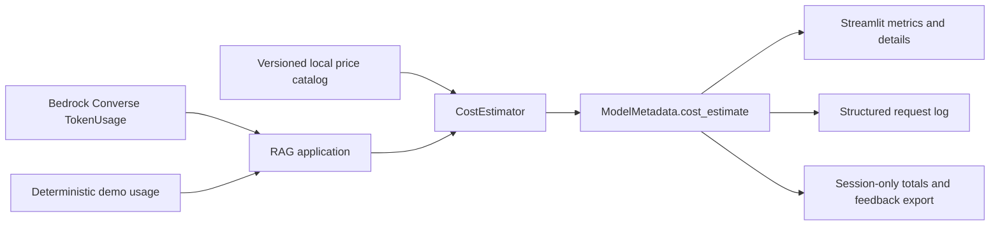

# LLM cost estimation

The application reports a transparent estimate for each language-model
request. Estimation is provider-neutral, offline, and separate from AWS
billing. It adds no CDK resources, network calls, or Cost Explorer access.

## Architecture



`knowledge.costs.CostEstimator` accepts a model ID, input and output token
counts, optional cache-read and cache-write counts, Region, and runtime mode.
`CatalogCostEstimator` is the default implementation. It loads and validates
`knowledge/pricing_catalog.json` once during runtime composition and performs
no web request.

`CostEstimate` retains token counts even when pricing is unavailable. It
contains the component costs, rates, currency, pricing source, effective date,
catalog version, estimated/chargeable flags, and warnings. The optional value
on `ModelMetadata` preserves compatibility for callers that do not configure an
estimator.

The offline prompt comparison reuses `CatalogCostEstimator` with a deliberately
synthetic profile: USD 0.25 per million input tokens and USD 1.25 per million
output tokens. It keeps prompt, context, and output counts separate and labels
every amount as simulated with no provider charge. The profile is only a stable
relative-cost input for comparing prompt strategies; it is not stored in the
application price catalog and must not be presented as Bedrock pricing.

## Formula and precision

Money uses Python `Decimal`, not binary floating point:

```text
input cost  = inputTokens  / 1,000,000 × input rate per million
output cost = outputTokens / 1,000,000 × output rate per million
total       = input cost + output cost + configured cache components
```

Input and output rates differ because model providers price prompt processing
and generated tokens separately. Calculations retain exact Decimal precision;
the UI formats totals to at least six decimal places.

When both a cache token count and its matching catalog rate are available,
cache read and cache write are calculated as separate components. If cache
usage is reported but the corresponding rate is absent, the total is marked
unavailable rather than understated.

## Bedrock usage semantics

Bedrock mode uses `inputTokens` and `outputTokens` returned in the Converse API
`TokenUsage`. Bedrock defines these as the tokens sent to the model and the
tokens generated by the model. The application never estimates either count
from prompt characters. If Bedrock omits either authoritative value, cost is
unavailable and a warning explains that no count was fabricated.

Optional Converse cache usage fields are carried into the estimator when
present. Model, Region, inference tier, prompt caching, discounts, and AWS
pricing changes can all affect the eventual charge.

## Demo mode

The deterministic demo provider is offline. Its display is always:

```text
Estimated request cost: $0.000000
Demo mode — no Bedrock charge incurred
```

Demo token counts may be included in session usage totals, but demo estimates
never increase the AWS-charge total. No fictional Bedrock price is applied to
the fake model.

## Catalog behavior and maintenance

The bundled JSON catalog is versioned and scoped by exact model ID and Region.
It intentionally does not apply one rate to every model. The bundled legacy
Claude 3 Haiku entry retains its historical effective date and only the
`us-east-1` Region used by its AWS-published cost example; this prevents an old
price from being represented as newly effective or guessed for another Region.

Unknown models and Regions return an unavailable estimate while preserving
provider token counts. Requests continue normally. To use a reviewed catalog,
set either:

```powershell
$env:APP_PRICING_CATALOG_PATH = "C:\approved\bedrock-prices.json"
# Compatibility alias:
$env:DEA_PRICING_CATALOG_PATH = "C:\approved\bedrock-prices.json"
```

Catalog monetary values must be JSON strings so validation can construct exact
Decimals. The schema requires:

- `schema_version` (currently `1`)
- `pricing_version`, `pricing_effective_date`, and `pricing_source`
- a `models` list with model ID, currency, Region list, input rate, and output
  rate
- optional cache-read and cache-write rates

Before every release, maintainers must verify each model, Region, pricing mode,
cache rate, source, and effective date against the
[official Amazon Bedrock pricing page](https://aws.amazon.com/bedrock/pricing/).
The application must never scrape that page at runtime.

## Streamlit and exports

The response panel includes an `Estimated cost` metric and a `Cost details`
expander with usage, rates, component costs, catalog metadata, warnings, and
this disclaimer:

> This is an application estimate, not an AWS invoice. Actual charges may
> differ by model, Region, pricing mode, caching, discounts, and AWS pricing
> changes.

Streamlit maintains request count, input/output token totals, and chargeable
estimated cost in `st.session_state`. Request IDs deduplicate reruns. Nothing
is persisted to a file, database, or AWS service.

Feedback JSON and CSV retain their original fields and add model ID, token
counts, input/output/total estimated costs, and pricing version. Structured
request logs contain the same aggregate usage and pricing facts, but never
prompts, retrieved document contents, credentials, or embedding vectors.

## Limitations and deferred billing integration

These values are application estimates, not invoices or authoritative billing
records. They exclude embedding calls, storage, retrieval infrastructure,
taxes, credits, free tier, negotiated discounts, provisioned or reserved
capacity, and other AWS services. Cost Explorer, AWS Price List APIs,
organization billing, budgets, persistence, and managed cost dashboards remain
deferred pending an explicit security and infrastructure design.

Prompt-comparison figures have an even narrower meaning: they use whitespace
token counts and a synthetic profile, so they support relative offline
trade-offs only. Real-model evaluation must use provider-reported token usage,
the model-specific current catalog entry, and measured request latency.

The offline monitoring fixture also contains exact synthetic request-cost
values so reports can demonstrate totals, averages, thresholds, and prompt
grouping. Those values use the documented synthetic comparison rates, are
labeled simulated, and incurred no provider charge. Aggregate reports never
present them as AWS invoices.
