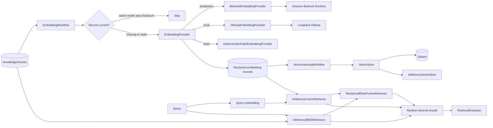

# Embedding and retrieval layer

## Scope

This layer adds Bedrock/Ollama-ready embedding orchestration, local vector
retrieval and persistence, and evaluation while preserving the original provider-neutral
`EmbeddingProvider` interface.

The document-ingestion Lambda creates chunks and a pending embedding descriptor
from supported S3 uploads. Its event processor now supports an injected
automatic indexing service. The synthesized stack keeps automatic indexing
disabled until provider networking, credentials, packaging, and permissions are
explicitly configured; it still receives no Bedrock permission by default. See
[Automatic vector indexing](AUTOMATIC_VECTOR_INDEXING.md).

## Architecture



The ingestion pipeline, embedding workflow, and retriever are separate
services:

- Ingestion preserves documents and creates chunks.
- Embedding consumes already-created chunks and writes vector records.
- Retrieval consumes vector records plus display-safe text and metadata.
- Evaluation consumes ranked results through a callback.

This separation allows extractors, models, and vector stores to evolve
independently.

## Provider interfaces

`EmbeddingProvider` remains the provider-neutral contract:

```python
class EmbeddingProvider(Protocol):
    provider_name: str

    def embed(self, texts: Sequence[str]) -> list[list[float]]:
        ...
```

### Amazon Bedrock

`BedrockEmbeddingProvider` uses boto3's `bedrock-runtime` client and
`InvokeModel`. The model ID and AWS Region are constructor settings; credentials
come from boto3's normal credential provider chain and are never stored in
source code.

The initial request and response adapter follows Amazon Titan Text Embeddings:

- Request field: `inputText`.
- Optional configured dimensions and normalization.
- Response field: `embedding`.

Bedrock model families can have different native request schemas. A future
provider for another family should implement `EmbeddingProvider` rather than
adding model-specific branches to orchestration.

The provider maps expected failures into stable local exceptions:

| Bedrock condition | Local exception |
| --- | --- |
| Throttling | `EmbeddingThrottledError` |
| Access denied or unauthorized | `EmbeddingAccessDeniedError` |
| Missing, not-ready, timed-out, or unavailable model | `EmbeddingModelUnavailableError` |
| Invalid JSON, missing vector, or invalid vector values | `MalformedEmbeddingResponseError` |
| Other invocation errors | `EmbeddingInvocationError` |

### Deterministic test provider

`DeterministicFakeEmbeddingProvider` derives normalized vectors from SHA-256.
The same model ID and input always produce the same vector. It does not use
Python's process-randomized `hash()` and never makes a network call.

### Local Ollama

`OllamaEmbeddingProvider` uses the established bounded HTTP pattern and the
official `/api/embed` request shape. Its URL, model, and connect/read timeouts
are configurable; the default model is `embeddinggemma`. Batches are sent as
one input array and every returned vector/count/dimension is validated. The
loopback-only provider is created only when selected. See
[Local Ollama and Qdrant RAG](LOCAL_VECTOR_RAG.md).

## Configuration

`EmbeddingRetrievalConfig` validates settings when constructed:

| Setting | Default |
| --- | --- |
| `bedrock_region` | `us-west-2` |
| `embedding_model_id` | `amazon.titan-embed-text-v2:0` |
| `embedding_batch_size` | `8` |
| `top_k` | `5` |
| `minimum_similarity_threshold` | `0.0` |

Batch size controls orchestration grouping. Titan text embedding inference
accepts one input text per native invocation, so the provider performs one
`InvokeModel` request for each text in the group.

## Versioned embedding record

Records are stored beneath:

```text
knowledge/embeddings/{document_id}/{url_encoded_chunk_id}.json
```

Schema version 1:

```json
{
  "schema_version": 1,
  "document_id": "document-123",
  "chunk_id": "document-123:000000",
  "chunk_text_checksum": "sha256-hex-value",
  "embedding_model_id": "amazon.titan-embed-text-v2:0",
  "embedding_provider": "amazon-bedrock",
  "embedding_dimensions": 1024,
  "embedding_vector": [0.01, -0.02],
  "creation_timestamp": "2026-07-27T14:00:00Z",
  "source_object_key": "knowledge/raw/document-123/runbook.md"
}
```

Readers reject unsupported schema versions, missing fields, dimension
mismatches, booleans, and non-finite vector values.

## Incremental embedding

`EmbeddingWorkflow.embed_document` applies these rules per chunk:

1. Calculate SHA-256 over the exact UTF-8 chunk text.
2. Read the chunk's expected embedding record key.
3. Skip when the stored provider, model ID, checksum, and document-wide vector
   dimension match. Legacy records without provider identity remain readable.
4. Re-embed when the record is missing, malformed, uses another model, or has a
   different checksum.
5. Persist each successful record independently.
6. Continue later batches after a failed batch.
7. Return created records, skipped chunk IDs, and sanitized per-chunk failures.

If a manifest repository is supplied, a fully successful run sets the document
embedding status to `complete`; any partial failure sets it to `failed`.

Structured logs contain document ID, chunk ID, model ID, elapsed milliseconds,
and outcome. They never contain full chunk text or embedding vectors.

`VectorIndexingWorkflow` is the reusable automatic indexing service. It reads
the existing descriptor and chunk artifact, invokes `EmbeddingWorkflow` only
for pending chunks, validates a consistent finite dimension, upserts each
successful chunk through `VectorStore`, and records partial progress in both
the descriptor and extended manifest. Already indexed chunks are skipped. The
S3 event adapter uses its existing retry/DLQ path when an enabled indexing run
is incomplete.

## Retrieval

`Retriever` accepts a query vector and returns ranked `RetrievalResult` values:

- `document_id`
- `chunk_id`
- `source`
- `text`
- `similarity_score`
- `metadata`

`InMemoryCosineRetriever` is intended for local development, deterministic unit
tests, and small evaluation corpora. It validates non-zero finite vectors,
requires matching dimensions, filters by minimum similarity, applies
deterministic tie-breaking, and limits results using configurable top-k.

`InMemoryBM25Retriever` implements dependency-free lexical ranking with
validated k1, length normalization, top-k, and minimum-score settings. It
requires explicit client and environment values and calculates corpus
statistics only from matching entries.

`ReciprocalRankFusionRetriever` combines scoped semantic and keyword ranks using
validated weights and a rank constant. Reciprocal rank fusion avoids treating
cosine and BM25 raw scores as comparable. Both new retrievers return the
existing `RetrievalResult` model and preserve source text and metadata.
`KeywordRetriever` and `HybridRetriever` provide their provider-neutral
protocol boundaries without changing the existing vector `Retriever` contract.

These in-memory retrievers are not durable or distributed production indexes.

`VectorStore` is the minimal provider-neutral durable storage boundary.
`InMemoryVectorStore` applies client/environment filtering before cosine
ranking. `QdrantVectorStore` translates the same contract to cosine Qdrant
collections, deterministic UUID point IDs, payload upsert, score thresholds,
and mandatory Qdrant `must` filters for client and environment. Optional
namespace/domain/source filters are also applied inside the database query.

## Evaluation metrics

`RetrievalEvaluationCase` stores a test query and expected document or chunk
IDs. `RetrievalEvaluator` runs cases through any query callback and calculates:

- Precision at k: relevant results in the first k positions divided by k.
- Recall at k: expected targets matched in the first k positions divided by all
  expected targets.
- Reciprocal rank: inverse rank of the first relevant result.
- Mean reciprocal rank: average reciprocal rank across all cases.

The repository now compares:

- Semantic retrieval using embedding similarity.
- Keyword retrieval using lexical matching.
- Hybrid retrieval combining semantic and keyword scores.

The versioned 35-query benchmark, runner, reports, metrics, selection method,
and limitations are documented in
[Retrieval strategy evaluation](RETRIEVAL_EVALUATION.md). Optional reranking
remains deferred.

Evaluation sets should eventually include real, access-controlled questions and
relevance judgments without placing sensitive document contents in source
control.

## Optional local and deferred managed vector stores

Qdrant is supported as an explicitly activated, host-local vector store. It is
not provisioned by CDK and ordinary tests use the Qdrant client's in-process
mode or mocks. See [Local Ollama and Qdrant RAG](LOCAL_VECTOR_RAG.md).

No managed vector store has been selected or provisioned. Future evaluation can
compare Amazon OpenSearch Serverless, Aurora PostgreSQL with pgvector, Amazon
Kendra, S3 Vectors, or another approved service against:

- Corpus size and query throughput.
- Recall and latency targets.
- Metadata filtering requirements.
- Tenant isolation and encryption.
- Operational burden and disaster recovery.
- Ingestion, storage, and query cost.

The `Retriever` interface is the boundary for a future implementation.

## Security and cost

- Use workload roles and boto3's credential chain; never hard-code keys.
- Grant `bedrock:InvokeModel` only to the selected model and runtime role.
- Keep client records in client-specific buckets or prefixes and indexes.
- Encrypt stored records using the existing bucket controls.
- Do not log vectors, full text, credentials, or Bedrock response bodies.
- Apply retries with exponential backoff and jitter for throttling in the future
  runtime boundary.
- Bound batch sizes and skip unchanged chunks to avoid duplicate inference cost.
- Track model ID because changing models triggers intentional re-embedding cost.
- Evaluate dimensions carefully: larger vectors increase storage and retrieval
  costs.

## Deferred embedding runtime wiring

The S3 document trigger, retries, failure queue, bounded concurrency, and
least-privilege document-processing role are implemented in
[Event-driven document ingestion](EVENT_DRIVEN_INGESTION.md).
`TODO(bedrock-runtime)` now marks only the boundary for a separately approved
embedding execution layer. That later step still requires model-scoped IAM,
cost controls, retry policy, and an explicit trigger decision.

Official references:

- [InvokeModel API](https://boto3.amazonaws.com/v1/documentation/api/latest/reference/services/bedrock-runtime/client/invoke_model.html)
- [Titan text embedding request and response](https://docs.aws.amazon.com/bedrock/latest/userguide/model-parameters-titan-embed-text.html)
- [Bedrock API error troubleshooting](https://docs.aws.amazon.com/bedrock/latest/userguide/troubleshooting-api-error-codes.html)
