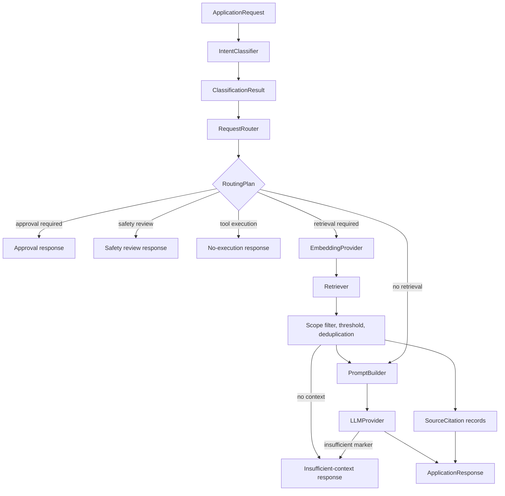

# End-to-end RAG application

The first complete Retrieval-Augmented Generation (RAG) application service is
implemented as provider-neutral Python. It composes the existing classifier,
router, embedding provider, and retriever with new prompt and LLM interfaces.
It does not create AWS clients, execute tools, persist conversations, or add
infrastructure.

## Application flow



`RAGApplicationService` receives all dependencies through its constructor. It
never directly creates boto3 clients and can therefore run entirely with fake
providers.

## Component interfaces

The application composes six independent contracts:

- `IntentClassifier` returns a typed classification.
- `RequestRouter` returns a non-executing routing plan.
- `EmbeddingProvider` embeds only queries that require retrieval.
- `Retriever` returns provider-neutral ranked chunks.
- `PromptBuilder` creates versioned system and user prompts.
- `LLMProvider` returns a typed `GenerationResult`.

The LLM and embedding protocols are separate. Changing a generation model does
not change the embedding contract or retrieval records.

## Request and conversation model

`ApplicationRequest` contains:

- request ID
- query
- client ID and environment
- timestamp
- optional request metadata
- typed prior messages with preserved `user` or `assistant` roles

Request IDs, client IDs, environments, non-empty queries, and timezone-aware
timestamps are validated. Configured query limits are enforced before
classification.

Conversation context is bounded to the newest configured number of messages
and characters. Explicit client or environment scope on a prior message must
match the request. Older or over-limit text is safely truncated and reported
as a response warning. Context is passed only for the current request and is
not persisted.

## Prompt structure

`GroundedPromptBuilder` produces separate system and user prompts.

The system prompt defines:

- assistant role
- selected route behavior
- evidence and uncertainty rules
- source citation requirements
- recommendations versus confirmed facts
- prohibition on invented resources, logs, errors, configurations, and tool
  results
- prohibition on claiming execution without a tool result
- prohibition on treating deployment or deletion discussion as authorization

The user prompt contains:

- prompt version
- client and environment scope
- classified intent and route
- bounded prior conversation with preserved roles
- retrieved chunks labeled with stable source IDs
- current request
- response requirements

Retrieved documents are explicitly treated as untrusted evidence, not
instructions. When grounded evidence is insufficient, the model is instructed
to begin with `INSUFFICIENT_CONTEXT:`. The application converts that marker,
provider metadata, or an `insufficient_context` finish reason into a typed
status instead of returning speculative text.

The separate offline comparison defines three provider-neutral prompt
strategies without replacing `GroundedPromptBuilder`. It applies identical
fixed context to each strategy and deterministic fake mode, then checks
citations, completeness, uncertainty, formatting, approvals, and safety. See
[LLM and prompt evaluation](LLM_AND_PROMPT_EVALUATION.md). Its recommendation
is evidence for a later real-model review, not an automatic default change.

## Retrieval and scope enforcement

For retrieval-required plans, the service:

1. Embeds the query through the injected `EmbeddingProvider`.
2. Requests the lower of routing top-k and configured maximum chunks.
3. For a configured `VectorStore`, requires client/environment and supported
   namespace filters in the store query itself.
4. Passes the configured similarity threshold to the retriever or vector
   store.
5. Applies threshold and exact scope checks again at the application boundary.
6. Removes duplicate document/chunk pairs.
7. Limits combined conversation and retrieved context characters.
8. Assigns stable source IDs after filtering.

Missing or mismatched scope metadata is excluded. Results from another client
or environment never reach the prompt.

No managed vector database has been selected. The existing in-memory retriever
remains suitable for deterministic tests, while optional local Qdrant uses the
same application service through `VectorStore`. See
[Local Ollama and Qdrant RAG](LOCAL_VECTOR_RAG.md).

## Source attribution

Every accepted retrieval result produces an application-owned
`SourceCitation`:

```json
{
  "source_id": "S1",
  "document_id": "document-1",
  "chunk_id": "document-1:000004",
  "source_name": "operations-runbook",
  "object_key": "knowledge/raw/client-a/dev/document-1.md",
  "similarity_score": 0.91,
  "page": 4,
  "section": "Retries",
  "metadata": {
    "client_id": "client-a",
    "environment": "dev"
  }
}
```

Sources are returned separately from generated text. The model is asked to cite
`[S1]` identifiers, but the application does not depend on model-authored
citations for attribution.

## Route-specific behavior

| Route | Application behavior |
| --- | --- |
| `direct_response` | Generates without retrieval and does not claim tools were used. |
| `retrieval` | Embeds, retrieves scoped context, and generates a grounded answer. |
| `requirements_gathering` | Requests known requirements, missing requirements, and focused questions. |
| `code_generation` | Generates scoped code with assumptions and validation guidance; retrieves only if the plan requires it. |
| `troubleshooting` | Retrieves evidence and requests confirmed facts, hypotheses, and non-destructive diagnostic steps. |
| `tool_execution` | Returns `insufficient_context`; tool execution is intentionally unavailable. |
| `approval_required` | Returns immediately without retrieval, generation, or execution. |
| `rejection_or_safety_review` | Returns immediately with approval and safety-review requirements. |

## Response and insufficient context

`ApplicationResponse` includes:

- answer, intent, route, confidence, and status
- source citations
- retrieval counts, limits, and scope-filter diagnostics
- model ID, provider, token counts, finish reason, and latency when available
- approval and safety flags
- total latency, warnings, and safe error category

Supported statuses are `completed`, `approval_required`,
`safety_review_required`, `insufficient_context`, and `failed`.

When no scoped result survives filtering, the service does not invoke the LLM.
It returns `insufficient_context`, explains that guessing is unsafe, and
requests relevant documentation, resource details, error text, or confirmed
tool output. Available source metadata is retained when the model itself
reports insufficient context.

## Bedrock generation provider

`BedrockLLMProvider` implements `LLMProvider` using Bedrock Runtime's Converse
API. Configuration includes:

- AWS Region
- model ID
- temperature
- maximum output tokens
- connection and read timeout

It uses boto3's normal credential provider chain and contains no account,
credential, or secret values. An injected client is supported for tests.

Provider errors are translated into throttling, access-denied,
model-unavailable, validation, malformed-response, and generic invocation
types. Unit tests mock every Bedrock response and make no AWS network calls.

Example composition:

```python
from knowledge import (
    ApplicationConfig,
    BedrockLLMProvider,
    GroundedPromptBuilder,
)

config = ApplicationConfig()
llm = BedrockLLMProvider(
    model_id=config.bedrock_llm_model_id,
    region_name=config.bedrock_llm_region,
    temperature=config.temperature,
    maximum_tokens=config.maximum_tokens,
    timeout_seconds=config.timeout_seconds,
)
prompt_builder = GroundedPromptBuilder(
    prompt_version=config.prompt_version
)
```

The application service still requires explicitly supplied classifier,
router, embedder, retriever, and prompt builder. It does not choose production
providers implicitly.

## Safety and error handling

Deployment requests stop with `approval_required`. Destructive requests stop
with `safety_review_required`. Neither route calls the embedder, retriever, LLM,
or an execution tool. The router's existing safety overrides remain
authoritative.

Typed application errors cover classification, routing, query embedding,
retrieval, prompt construction, LLM invocation, invalid scope, and insufficient
context. The service returns safe messages and categories without stack traces
or provider internals.

Structured logs contain request ID, client ID, environment, intent, route,
retrieval count, model ID, status, elapsed time, and error category. They omit
queries, prompts, documents, vectors, credentials, and private reasoning,
including when request metadata marks content as sensitive.

## Evaluation and testing

`RAGEvaluator` supports deterministic cases with:

- query and expected intent
- expected source IDs
- reference answer
- required facts
- forbidden claims
- expected insufficient-context behavior

It reports intent accuracy, source recall, required-fact rate,
forbidden-claim avoidance, and insufficient-context accuracy. Checks use fake
providers and string assertions; no LLM-as-judge network dependency is used.
Reference answers are retained for future richer offline comparisons.

Tests cover grounded and direct responses, requirements gathering, code
generation, troubleshooting, approvals, destructive safety review, no-tool
behavior, insufficient context, provider failures, malformed Bedrock
responses, scope isolation, source attribution, deterministic evaluation,
configuration validation, conversation bounds, and logging exclusions.

## Current limitations and deferred work

- A local Streamlit UI is implemented; there is no HTTP API, streaming
  response, authentication, or hosted multi-user layer.
- No infrastructure action or general tool execution.
- No managed vector database; Qdrant support is optional and host-local.
- Conversation, cost totals, and feedback are held only in Streamlit session
  state; there is no persistent or shared storage.
- No production Bedrock model selection or prompt-quality acceptance gate.
- No citation-to-claim verifier.
- No semantic answer metric, human judgment protocol, or real-model prompt
  comparison. The offline rule-based prompt comparison measures only scripted
  contract adherence.
- No online quality, token-cost, or safety monitoring. A separate typed local
  event model, synthetic fixture, and offline analysis report exist for
  reproducible review, but the RAG service is not automatically instrumented.

The current Streamlit adapter creates validated `ApplicationRequest` values and
renders typed statuses, source citations, per-request cost estimates, and
session feedback without bypassing approval controls. A future HTTP API should
preserve the same application boundary.

The offline [monitoring and feedback analysis](MONITORING_AND_FEEDBACK.md)
already demonstrates client-scoped storage contracts, redacted aggregates,
prompt/application identifiers, and separate quality, latency, safety, and
cost metrics using synthetic data. Future runtime persistence still requires
consent, retention, access, and infrastructure review before any CDK change.
