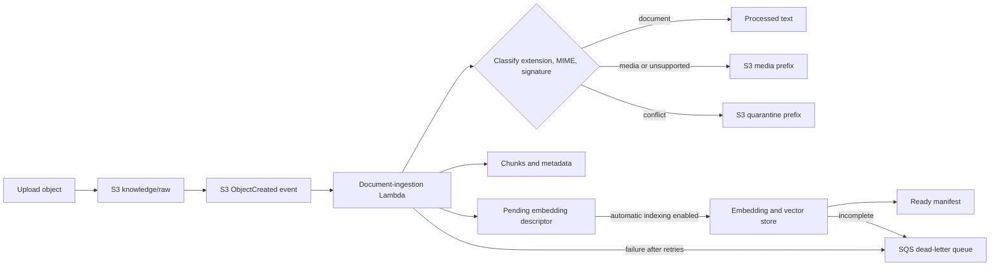

# Event-driven document ingestion

## Scope

The CDK stack connects the existing versioned knowledge bucket to a dedicated
document-ingestion Lambda. This is an application ingestion path, not a
Streamlit upload feature. Provider calls occur only when the separately
configured automatic indexing service is enabled.



The S3 notification has exactly one prefix filter:

```text
knowledge/raw/
```

There are no suffix filters. The handler performs file-type validation so one
notification configuration can support several document formats without
overlapping S3 notification rules.

## Supported documents

The Lambda processes UTF-8 text formats with `Utf8TextExtractor` and
text-based PDFs with `PdfTextExtractor`:

| Extension | Current behavior |
| --- | --- |
| `.txt` | Processed |
| `.md`, `.markdown` | Processed as UTF-8 text |
| `.html` | Processed as UTF-8 text |
| `.json` | Processed as UTF-8 text |
| `.py` | Processed as UTF-8 text |
| `.pdf` | Processed locally, page by page, with `pypdf` |
| `.docx` | Storage-only unsupported binary; parsing remains deferred |
| Listed image, video, and audio types | Storage-only media object |
| Other or extensionless binary objects | Storage-only unsupported binary |

PDF extraction preserves page order, normalizes line endings, and inserts a
deterministic form-feed separator between pages. It does not use OCR or execute
JavaScript, attachments, macros, or embedded files. A PDF with no pages, no
meaningful extractable text, only scanned/image content, malformed structure,
or password encryption fails its record. It is not accepted as an empty
successful document. DOCX cannot enter direct or event-driven text processing
until a tested extractor exists.

The default maximum source size is 10 MiB. Folder placeholders, malformed
records, records for another bucket, non-`ObjectCreated` events, generated
output objects, and objects outside the raw prefix are safely skipped.

## Processing flow

For each usable S3 record, the orchestration service:

1. URL-decodes the object key using S3 form-encoding rules.
2. Requests the exact S3 version when the event includes a version ID.
3. Reads the source bytes without logging document contents.
4. Calculates SHA-256 while retaining a bounded body for classification.
5. Classifies extension, declared MIME type, and detected signature.
6. Routes media and unsupported objects to scoped S3 storage, or conflicts to
   quarantine, and writes storage-only metadata without creating a manifest.
7. For indexable documents, derives a stable document ID and checks the
   existing manifest.
8. Delegates metadata extraction, text extraction, chunking, output storage,
   pending embedding state, and manifest persistence to
   `KnowledgeIngestionPipeline`.
9. References the already-uploaded raw key instead of copying the source.
10. When configured, invokes the injected indexing service with the stack's
   client/environment and configured namespace/domain.

For a successful PDF, the per-document metadata record adds a non-content
`extraction` object with page count, extracted-page count, pages containing
text, parser name and version, encryption state, and extraction format.
Document text remains only in the processed and chunk objects.

One event can contain multiple `Records`. A failed valid record does not
prevent later independent records from being attempted. The handler then
raises `IngestionBatchError` if any valid record failed so Lambda asynchronous
retry and dead-letter behavior remains active. Successful events return:

```json
{
  "records_received": 1,
  "records_processed": 1,
  "records_skipped": 0,
  "records_failed": 0,
  "indexable_documents_received": 1,
  "media_objects_stored": 0,
  "unsupported_binaries_stored": 0,
  "suspicious_objects_quarantined": 0,
  "media_indexing_attempts_blocked": 0,
  "mime_mismatch_count": 0
}
```

Structured logs include scope, record index, outcome, reason, elapsed time,
document ID when available, file type, and a short SHA-256 key digest. They do
not include source bytes, extracted text, chunks, vectors, credentials, or the
full object key.

## Output layout

The original upload stays at its caller-selected key under
`knowledge/raw/`. Generated objects use the existing canonical layout:

```text
knowledge/processed/{document_id}.txt
knowledge/chunks/{document_id}.json
knowledge/embeddings/{document_id}.json
knowledge/metadata/{document_id}.json
knowledge/metadata/manifest.json
knowledge/media/{client_id}/{environment}/{media_type}/{object_id}/{filename}
knowledge/quarantine/{client_id}/{environment}/{object_id}/{filename}
knowledge/metadata/storage-only/{object_id}.json
```

The embedding descriptor starts with one `pending` state per chunk. The
synthesized Lambda has no Bedrock permission and automatic indexing is disabled
by default. When explicitly enabled, its composition layer constructs the
selected provider/store and the event processor waits for a complete indexing
report. See [Automatic vector indexing](AUTOMATIC_VECTOR_INDEXING.md).

Because only `knowledge/raw/` is registered as an event source, none of the
generated output locations can recursively invoke the function.

## Idempotency

S3 notifications are treated as at-least-once delivery. The stable document ID
is SHA-256 over:

```text
source bucket
decoded object key
object version ID, or ETag when no version ID is available
content SHA-256
```

Objects written by the existing direct pipeline already carry a validated
32-character document ID and content checksum in S3 user metadata. The event
runtime reuses that ID instead of creating a second logical document. Its
manifest entry is checked using the same raw key and checksum, including for
objects that predate the event runtime.

The aggregate manifest is checked for that ID and content checksum before any
artifact is regenerated. A duplicate notification for the same source version
is therefore recorded as `already_processed` and skipped. A new object version
or changed content receives a different ID and is processed independently.

Retries after a partial write safely overwrite deterministic per-document
keys. The manifest is written last and is the completion marker.

## IAM and concurrency

The dedicated ingestion role can:

- list only the metadata and embeddings prefixes in the knowledge bucket so a
  missing manifest or pending descriptor can be distinguished from an
  access-denied object;
- read source objects and object versions only under `knowledge/raw/`;
- read manifest data under `knowledge/metadata/` and existing pending
  descriptors under `knowledge/embeddings/`;
- write only `knowledge/processed/`, `knowledge/chunks/`,
  `knowledge/embeddings/`, `knowledge/metadata/`, `knowledge/media/`, and
  `knowledge/quarantine/`, while receiving no media or quarantine read grant;
- write to the dedicated log group; and
- send failed asynchronous events to the dedicated dead-letter queue.

It cannot write to the raw prefix, read other buckets, access SSM, or invoke
Bedrock. No statement grants `s3:*` or unrestricted allow access.

Reserved concurrency is omitted unless explicitly configured for an
environment with sufficient quota. Aggregate manifest writes use the existing
conditional conflict handling and bounded retries.

## Retry and failure behavior

S3 invokes the function directly. Lambda's asynchronous invocation subsystem
performs its standard retries for function errors. After retry exhaustion,
Lambda sends the original event to an SQS dead-letter queue:

- SQS-managed encryption is enabled.
- TLS is required.
- Failed events are retained for 14 days.
- No automatic redrive consumer or alarm is created yet.

The queue payload contains S3 event metadata such as the bucket and object key,
but not the source document bytes. Queue access must remain restricted to
operators responsible for recovery.

Malformed/out-of-scope records are skipped. Media and unsupported binaries are
stored without indexing; mismatches and oversized would-be text documents are
quarantined without retry as ordinary documents. Source-read failures, invalid
UTF-8, invalid or encrypted PDFs, PDFs without extractable text, storage
failures, conflicting manifest state, and unexpected exceptions fail the batch
after other practical records have been attempted. This distinction keeps
storage routes out of the normal retry path while allowing supported-but-invalid
PDFs to be visible through Lambda retries and the DLQ.

The queue is a failure destination only; SQS is not between S3 and Lambda.
Direct S3 notification is sufficient for the current low-volume development
stage. A future S3-to-SQS-to-Lambda design would be appropriate if backlog
control, batch consumption, independent redrive, or higher sustained
throughput becomes necessary.

## Offline verification

Use Python 3.12:

```powershell
python -m compileall knowledge lambda tests
python -m pytest tests/unit/test_pdf_extraction.py
python -m pytest tests/unit/test_document_ingestion_handler.py
python -m pytest tests/unit/test_data_engineering_assistant_cdk_stack.py
cdk.cmd synth -c client=internal-dev
git diff --check
```

The unit tests use in-memory storage and a fake S3 client. They make no AWS or
Bedrock call. Test PDFs are generated in memory with `pypdf`; no fixture
downloads, OCR tools, or system PDF utilities are required.

Runtime dependencies are declared in `requirements.txt` and pinned exactly in
`constraints.txt`. CDK local bundling copies only the handler, the `knowledge`
package, `pypdf`, and the pinned `requests` dependency closure into the
ingestion Lambda asset. Tests, virtual environments, caches, and native Windows
extensions are excluded.

## Deployment and upload

Deployment remains a deliberate operator action. First review the synthesized
template and an authenticated diff in the intended account:

```powershell
cdk.cmd synth -c client=internal-dev
cdk.cmd diff -c client=internal-dev
cdk.cmd deploy -c client=internal-dev --require-approval broadening
```

Do not run the last two commands without the required AWS access, account and
Region checks, cost review, and project approval.

After deployment, uploading a supported document invokes Lambda and can create
S3, Lambda, CloudWatch Logs, and failure-queue charges:

```powershell
aws s3 cp .\path\runbook.pdf s3://<knowledge-bucket>/knowledge/raw/runbook.pdf --region <aws-region>
```

Use placeholders until the intended bucket and Region have been independently
verified. Never upload credentials, private customer documents, purchased
content, or other data that is not approved for this environment.

## Deferred work

- DOCX extraction.
- OCR for scanned/image-only PDFs.
- An approved password source and policy if encrypted PDFs are ever required.
- Antivirus or deeper content-safety scanning beyond signature isolation.
- Conditional or transactional manifest updates for parallel writers.
- DLQ alarms, automated redrive, and operational dashboards.
- A separately approved embedding trigger and model-specific IAM permission.
- Production throughput, large-document, and load testing.

Official AWS references:

- [Process Amazon S3 event notifications with Lambda](https://docs.aws.amazon.com/lambda/latest/dg/with-s3.html)
- [Lambda asynchronous error handling and retries](https://docs.aws.amazon.com/lambda/latest/dg/invocation-async-error-handling.html)
- [Amazon S3 GetObject permissions and missing-key behavior](https://docs.aws.amazon.com/AmazonS3/latest/API/API_GetObject.html)
