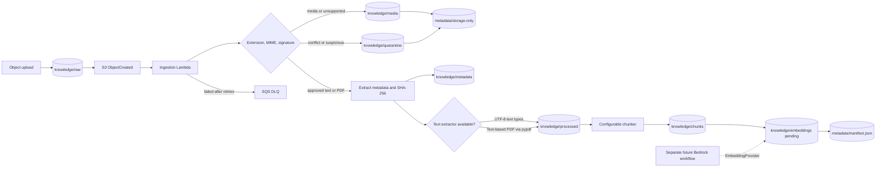

# Knowledge layer

## Purpose

The knowledge layer preserves source documents in the existing knowledge S3
bucket, extracts stable metadata, prepares text chunks, and records ingestion
state independently from embedding providers. The stack provides an optional
event-driven runtime for supported documents uploaded under
`knowledge/raw/`.

## Object layout

Each logical directory is an S3 object-key prefix:

```text
knowledge/
|-- raw/{uploaded-path}
|-- media/{client_id}/{environment}/{media_type}/{object_id}/{filename}
|-- quarantine/{client_id}/{environment}/{object_id}/{filename}
|-- processed/{document_id}.txt
|-- chunks/{document_id}.json
|-- embeddings/{document_id}.json
`-- metadata/
    |-- {document_id}.json
    `-- manifest.json
```

- `raw` preserves the uploaded bytes without modification. Direct application
  ingestion uses `{document_id}/{filename}`; S3-triggered ingestion references
  the caller's existing key without copying it.
- `processed` stores UTF-8 text prepared for chunking.
- `chunks` stores document-aware character chunks.
- `embeddings` stores per-chunk pending/indexed state and versioned records.
- `metadata` stores per-document metadata and the aggregate manifest.

## Media Storage and Indexing Policy

The S3 event boundary classifies every object before text extraction using
three independent signals where practical: normalized extension, the object's
declared S3 `ContentType`, and a deterministic signature or UTF-8 inspection.
The four classifications are `indexable_text_document`, `media_object`,
`unsupported_binary`, and `rejected_or_suspicious`.

Only `html`, `json`, `markdown`, `md`, `pdf`, `py`, and `txt` are approved for
event-driven indexing. A PDF must have a PDF signature and then pass the
existing local PDF text extractor. Text formats must decode safely as UTF-8 and
must be consistent with their extension and declared MIME type. The classifier
does not start OCR, image captioning, transcription, multimodal embedding, an
LLM, or any network provider.

Images (`jpg`, `jpeg`, `png`, `gif`, `webp`, `bmp`, `tiff`, `svg`, `heic`),
video (`mp4`, `mov`, `avi`, `mkv`, `webm`, `mpeg`, `mpg`, `m4v`), and audio
(`mp3`, `wav`, `m4a`, `aac`, `flac`, `ogg`) are copied from the raw upload to:

```text
knowledge/media/{client_id}/{environment}/{media_type}/{object_id}/{filename}
```

They receive `storage_only=true` and `indexable=false`. Their separate metadata
record retains safe object facts such as original filename, SHA-256 checksum,
content types, byte size, upload time, client, environment, and source/storage
S3 URIs. No document manifest, processed text, chunks, pending embedding
descriptor, embedding record, relational record, or vector point is created.
Consequently media cannot appear in RAG retrieval.

Unsupported binary objects use the same storage-only hierarchy under the
`other` media type. A known executable signature, extension/signature conflict,
declared MIME mismatch, or oversized would-be text document is copied to:

```text
knowledge/quarantine/{client_id}/{environment}/{object_id}/{filename}
```

The storage-only metadata record contains a machine-readable
`quarantine_reason`. Suspicious objects complete the classification route and
are not retried as ordinary documents. Fail-closed guards repeat immediately
before extraction, chunking, embedding, automatic indexing, and vector-store
upsert so a forged or incorrectly routed classification cannot cross stages.

The Lambda role may read raw objects and write only the established processed,
chunk, embedding, metadata, media, and quarantine prefixes. It has no media or
quarantine read grant, no deletion grant, and no bucket-wide object permission.
The bucket notification matches only `knowledge/raw/`; therefore writes to
media, quarantine, metadata, processed, chunks, or embeddings cannot form an
event loop. Structured batch logs expose the six isolation counters without
object names or contents:

- `indexable_documents_received`
- `media_objects_stored`
- `unsupported_binaries_stored`
- `suspicious_objects_quarantined`
- `media_indexing_attempts_blocked`
- `mime_mismatch_count`

## Architecture



The ingestion pipeline depends on storage, chunking, extraction, and manifest
interfaces. `S3KnowledgeStorage` is the production S3 adapter; tests use an
in-memory implementation and never call AWS. The Lambda handler delegates S3
record validation to `S3DocumentIngestionProcessor`, which then calls the same
pipeline used by direct application ingestion.

## Ingestion flow

1. Generate a document ID, or derive a stable ID for an existing S3 version.
2. Validate the filename, supported extension, source, and maximum size.
3. Calculate SHA-256 and normalized UTC timestamps.
4. Preserve the unchanged source bytes under `knowledge/raw`, or reference the
   already-uploaded event source without copying it.
5. Extract UTF-8 text or page-ordered PDF text when an extractor is registered.
6. Write the per-document metadata JSON, including safe extraction metadata
   for PDFs.
7. Write processed text and configurable overlapping chunks.
8. Write an embedding descriptor with status `pending`; no model is called.
9. Upsert the document into `knowledge/metadata/manifest.json`.
10. Emit a structured JSON log for each step and the overall ingestion result.

Direct and event ingestion now process text-based PDFs through the same
pipeline used for UTF-8 TXT, Markdown, HTML, JSON, and Python source files.
Direct application calls also fail closed for DOCX until an explicitly tested
extractor is added behind `DocumentTextExtractor`.

PDF extraction uses `pypdf`, reads pages in order, normalizes line endings, and
joins pages with a deterministic form-feed separator. It performs no OCR and
does not execute embedded content. Empty, image-only/scanned, malformed, and
password-protected PDFs raise typed extraction errors rather than producing an
empty successful document.

Duplicate S3 notifications are skipped using a stable ID based on the bucket,
decoded key, version ID or ETag, and content SHA-256. The manifest is the
completion marker. See
[Event-driven document ingestion](EVENT_DRIVEN_INGESTION.md) for exact record
behavior, retries, IAM, local tests, deployment guidance, and upload warnings.

## Metadata schema

Each document metadata record contains:

| Field | Meaning |
| --- | --- |
| `filename` | Original filename, without path components |
| `file_type` | Normalized lowercase file extension |
| `upload_timestamp` | UTC ISO-8601 timestamp |
| `checksum` | SHA-256 checksum of the original bytes |
| `source` | Caller-provided source identifier |
| `document_size` | Original size in bytes |
| `object_classification` | Must be `indexable_text_document` for document metadata |
| `detected_mime_type`, `declared_mime_type` | Signature-derived and S3-declared content types |
| `file_extension`, `media_type` | Normalized type fields used by the isolation policy |
| `storage_only`, `indexable` | Mutually reinforcing routing controls |
| `quarantine_reason` | Machine-readable reason, normally null for documents |
| `source_s3_uri` | Source URI when the input came from S3 |
| `checksum_sha256`, `size_bytes` | Explicit checksum and size aliases for storage-only parity |

The manifest entry adds `document_id`, `chunk_count`, `embedding_status`,
`ingestion_timestamp`, and the S3 keys for the raw, processed, chunk, and
embedding records.

Successful PDF metadata records also contain a top-level `extraction` object:

| Field | Meaning |
| --- | --- |
| `page_count` | Total pages reported by the parser |
| `extracted_page_count` | Pages successfully visited for text extraction |
| `pages_with_text` | Pages containing meaningful extracted text |
| `parser_library`, `parser_version` | Parser identity used for the result |
| `encrypted` | `false` for successful extraction |
| `extraction_format` | Processed-text and page-separator representation |

This extension does not alter `DocumentMetadata` or manifest schemas and never
stores source document text in metadata.

## Chunking strategy

`Chunker` is the stable interface. `TextChunker` is the initial character-based
implementation:

- `chunk_size` controls the maximum number of characters per chunk.
- `overlap` repeats trailing characters in the next chunk.
- Every chunk includes its document ID, index, chunk ID, and source character
  range.
- Empty text produces no chunks.

The strategy can later be replaced by token-aware or format-aware chunkers
without changing ingestion or manifest code.

## Configuration

`KnowledgeConfig` provides validated defaults:

- Chunk size: 1,000 characters.
- Overlap: 100 characters.
- Maximum upload size: 10 MiB.
- Direct-ingestion types: text-based PDF, Markdown, TXT, HTML, JSON, and Python
  source. DOCX is storage-only until an extractor is explicitly supported.
- Event-ingestion types: text-based PDF, Markdown, TXT, HTML, JSON, and Python
  source.

The parser is declared in `requirements.txt` and pinned in `constraints.txt`.
The ingestion Lambda bundle contains `pypdf`, the handler, and the `knowledge`
package while excluding tests, environments, and caches.

Construct a different `KnowledgeConfig` to override these values for a runtime.

## Bedrock-ready extension

`EmbeddingProvider` remains the provider-neutral embedding contract.
`BedrockEmbeddingProvider`, `OllamaEmbeddingProvider`, the deterministic fake
provider, incremental workflow, scoped vector stores, local retriever, and
evaluation framework are implemented as a separate application layer.
Ingestion itself still never selects or calls a model or database.

The document trigger, retry destination, and least-privilege ingestion IAM are
implemented. Its processor can now run an injected `VectorIndexingWorkflow`
automatically and resume partial descriptors on asynchronous retries. The
synthesized stack keeps this fail-closed switch disabled pending a reviewed
durable vector endpoint and model permission. See
[Automatic vector indexing](AUTOMATIC_VECTOR_INDEXING.md) and
[Embedding and retrieval architecture](EMBEDDING_AND_RETRIEVAL.md).

The ingestion Lambda uses reserved concurrency of one to protect the aggregate
manifest update. Before enabling parallel writers, the update must gain S3
conditional-write handling or move to a transactional index to prevent lost
updates.
