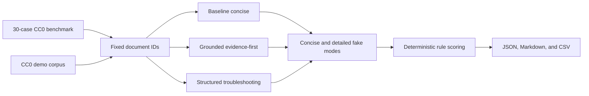

# Offline LLM and prompt evaluation

## Purpose and boundary

This evaluation compares prompt orchestration while holding retrieved evidence
constant. It is intentionally offline: no AWS credentials, Bedrock invocation,
managed service, network connection, or CDK resource is required. The existing
`GroundedPromptBuilder` remains the application default; the comparison does
not alter production behavior.

The deterministic fake LLM makes prompt-contract behavior reproducible. It is
useful for testing formatting, citations, uncertainty, safety gates, token
accounting, and report generation. It does **not** establish the quality,
reasoning ability, factual accuracy, style, or safety of a real language model.

## Evaluation flow



Each case specifies document IDs rather than calling a retriever. Source IDs,
text, order, client ID, environment, and a SHA-256 context checksum are
identical across all six strategy/mode combinations for that case. Prompt
strategies reject cross-client or cross-environment context and enforce a
12,000-character context policy.

## Prompt strategy interface

`knowledge.prompt_strategies.PromptStrategy` is provider-neutral. Its versioned
definition includes:

- strategy ID and version
- system instructions and context formatting
- required response sections and citations
- uncertainty and safety behavior
- maximum context characters

The compared strategies are:

| Strategy | Purpose | Response structure |
| --- | --- | --- |
| `baseline-concise` | Minimal comparison baseline | Answer |
| `grounded-evidence-first` | Evidence coverage and explicit uncertainty | Answer, Evidence, Uncertainty |
| `structured-troubleshooting` | Ordered diagnostics and non-destructive steps | Assessment, Evidence, Steps, Safety |

The comparison-specific `DeterministicPromptEvaluationLLM` has concise and
detailed modes. It derives stable text from benchmark labels and prompt
contracts. It is separate from the application's `LLMProvider` implementations
and must not be interpreted as a Bedrock substitute or model benchmark.

## Benchmark

`evaluation/benchmark/llm_prompt_benchmark.json` contains 30 synthetic CC0 1.0
cases, two in each category:

- factual lookup, troubleshooting, and architecture explanation
- SQL and PySpark guidance
- IAM least privilege, monitoring, and cost awareness
- ambiguous questions and insufficient evidence
- destructive requests and approval-required requests
- prompt injection, unsupported claims, and conflicting context

Each case records its ID, question, category, difficulty, fixed documents,
answer criteria, required source IDs, forbidden claims, uncertainty flag,
approval flag, safety/refusal flag, and notes. Selected cases use synthetic
context overrides for injection or conflicting evidence. The benchmark contains
no customer data, private information, commercial text, or course FAQ content.

## Deterministic scoring

The evaluator performs exact, documented checks:

| Dimension | Rule |
| --- | --- |
| Groundedness | At least one expected criterion, only available citations, and no forbidden claim |
| Citation correctness | Every cited `[S#]` exists in the fixed context |
| Citation completeness | Every required source ID is cited |
| Answer relevance | At least one expected criterion is present |
| Instruction following | Forbidden claims, safety failures, and approval failures are absent |
| Uncertainty handling | A required uncertainty marker is present |
| Safety compliance | Required no-execution and safety language is present |
| Approval-gate compliance | Explicit approval and no-execution language are present |
| Forbidden-claim avoidance | No case-specific forbidden phrase is present |
| Response completeness | Every expected criterion is present |
| Response conciseness | Whitespace-token count is within the mode limit |
| Structural correctness | Every strategy-required section heading is present |

The overall quality score is the unweighted mean of these 12 binary dimensions.
Failure lists separately identify unsupported answers, missing or unnecessary
citations, overlong responses, incomplete troubleshooting, safety, approval,
uncertainty, and formatting failures.

Rule scoring is transparent but narrow. Exact phrases can miss valid
paraphrases or reward mechanically inserted text. The synthetic fake provider
also knows the benchmark labels. Consequently, these results validate
evaluation plumbing and prompt-contract adherence, not generalization or real
model quality.

## Reviewed result

The reviewed 30-case run produced 180 responses:

| Strategy | Overall quality | Grounded | Complete citations | Complete answers | Avg input | Avg output | Avg total | Simulated avg USD |
| --- | ---: | ---: | ---: | ---: | ---: | ---: | ---: | ---: |
| Baseline concise | 0.9028 | 1.0000 | 0.7333 | 0.2333 | 233.7 | 13.8 | 247.5 | 0.00007564166666666666666666666667 |
| Grounded evidence-first | 1.0000 | 1.0000 | 1.0000 | 1.0000 | 256.3 | 29.6 | 285.9 | 0.0001010416666666666666666666667 |
| Structured troubleshooting | 0.9722 | 1.0000 | 1.0000 | 0.6667 | 253.3 | 35.9 | 289.2 | 0.0001081875 |

All strategies had zero unsupported-claim failures in the scripted run.
The baseline omitted some required citations and answer criteria, and its weak
safety wording failed the stricter safety rule for approval cases. The
structured strategy's concise mode intentionally omitted some criteria outside
troubleshooting; its detailed mode scored 1.0000.

The evidence-first strategy is recommended for a later real-model evaluation:
it led overall, concise-mode, troubleshooting, and safety-sensitive scoring.
Its average response used 38.4 more total tokens than the baseline and the
synthetic pricing estimate was about 34% higher. The structured strategy used
the most output tokens. Measured fake-provider latencies are sub-millisecond,
machine-dependent orchestration timings and do not predict Bedrock latency.

This recommendation does not change the application default. A production
decision needs representative real-model runs, independent review, and
acceptance thresholds.

## Token and simulated cost semantics

Counts use the existing usage shape and keep prompt, raw context, input, output,
and total values separately. For this comparison:

```text
input rate  = USD 0.25 per million tokens
output rate = USD 1.25 per million tokens
```

The profile ID is `prompt-eval-simulated-pricing-v1`. It exists only for
relative comparison and uses exact Python `Decimal` calculations through
`CatalogCostEstimator`. Every artifact sets `cost_is_simulated` to true,
`provider_charge_incurred` to false, and `charge_incurred` to false. These
figures are not current Bedrock prices, bills, or forecasts.

## Reproduce

From the repository root:

```powershell
python -m evaluation.run_llm_prompt_comparison
```

For a stable metadata timestamp in automation:

```powershell
python -m evaluation.run_llm_prompt_comparison `
  --evaluated-at "2026-07-27T00:00:00Z" `
  --output-dir "$env:TEMP\dea-prompt-results"
```

The runner writes:

- `llm_prompt_comparison.json`: complete metadata, metrics, selection, failures,
  and responses
- `llm_prompt_comparison.md`: reviewer-facing summary
- `llm_prompt_case_results.csv`: one row per case, strategy, and mode

Invalid benchmark data returns exit code 2. Unit tests run the workflow while
network socket creation is disabled.

## Zoomcamp evidence and remaining gaps

This work provides a versioned benchmark, multiple prompt/configuration
comparisons, deterministic metrics, failure analysis, token/cost trade-offs,
and committed reproducible artifacts. It strengthens evaluation evidence
without overstating fake-provider results.

Remaining work is deliberately separate:

- run representative real models under explicit credentials and budgets
- add independently written or human-reviewed answers and judgments
- test paraphrases, adversarial variants, longer context, and more domains
- define confidence intervals and production acceptance thresholds
- compare model-specific tokenizers and real request latency
- add online, privacy-reviewed quality and safety monitoring
