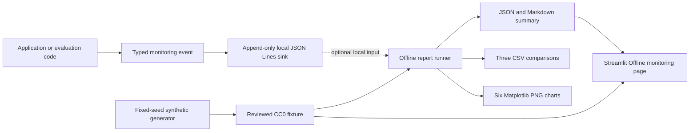

# Offline monitoring and feedback analysis

This subsystem creates reproducible, reviewer-friendly evidence from a
deterministic synthetic event fixture. It does not add production monitoring,
CloudWatch resources, deployment behavior, AWS calls, or network calls.

## Architecture



The reporting path reads local files only. The Streamlit page is read-only and
accepts only artifacts explicitly classified as synthetic.

## Typed event model

`knowledge.monitoring.MonitoringEvent` is a provider-neutral frozen dataclass
using schema version 1. The event types are:

- `application_request`
- `retrieval_completion`
- `llm_completion`
- `safety_decision`
- `approval_requirement`
- `user_feedback`
- `evaluation_run`
- `application_error`

Fields cover event, session, request, client, environment, runtime, intent,
retrieval, prompt, model, latency, tokens, estimated cost, source/citation,
approval, safety, outcome, error, feedback, and evaluation metadata where they
apply. Timestamps must be timezone-aware and serialize as UTC. Costs are
`Decimal` values serialized as strings.

Event-specific validation requires the relevant strategy, outcome, rating,
model, error category, or evaluation metadata. Tokens and latency cannot be
negative, total token counts must be internally consistent, identifiers are
bounded, and metadata is recursively size-limited.

The validation boundary rejects secret-like keys and values, AWS access-key
patterns, raw prompt keys, authorization headers, and private document-content
keys. Raw prompts, retrieved document text, embedding vectors, and credentials
are not fields in the default model. Aggregate reports never include free-form
feedback text.

## Local JSON Lines sink

`knowledge.monitoring.JsonLinesEventSink` defaults to:

```text
data/monitoring/events.jsonl
```

It creates parent directories safely, appends exactly one deterministic JSON
record per line, flushes each append, and never rewrites prior records.
Loading validates every event and can either fail immediately or return
line-numbered malformed-record diagnostics without including record contents.
Exact client and environment filters enforce local scope separation.

All `data/monitoring/*.jsonl` files are ignored by Git and the entire local
monitoring directory is excluded from the Docker build context. The local sink
is not a production store: it has no multi-process coordination, durable
retention, server-side encryption, access-control plane, or alert delivery.

## Reviewed synthetic fixture

The public CC0 fixture is:

```text
evaluation/fixtures/monitoring_events.jsonl
```

It contains 275 events representing 84 requests, 22 sessions, and two
fictional client/environment scopes. A fixed seed (`20260727`) and deterministic
ordering cover:

- grounded responses and incomplete citations
- no-result retrieval
- safety-sensitive and approval-required requests
- positive and negative feedback
- application errors, slow requests, and higher simulated costs
- semantic, keyword, and hybrid retrieval
- baseline concise, grounded evidence-first, and structured troubleshooting
  prompts
- concise and detailed response modes

No event contains real user text, customer content, credentials, or commercial
book content. Verify the committed fixture explicitly:

```powershell
python -m evaluation.generate_monitoring_fixture
```

The command succeeds without rewriting a matching fixture and fails if the
file differs. Add `--force` only when intentionally replacing it. Use
`--random-seed` or `--request-count` only when creating a new reviewed fixture
version.

## Metrics and grouping

`evaluation.monitoring_analysis` calculates request success/error/feedback
rates; positive and negative feedback; binary average rating; average, P50,
and P95 latency; retrieval and generation latency; input, output, and total
tokens; simulated total and per-request cost; no-result rate; citation
completion proxy; and safety and approval counts.

Metrics are grouped by UTC day, intent, retrieval strategy, prompt strategy,
runtime mode, safety outcome, client, and environment. Joins use the tuple
`(client, environment, request_id)`, preventing feedback or errors from one
scope from affecting another. A positive rating maps to 1 and a negative
rating maps to 0 solely for the synthetic average-rating metric.

The cost values are synthetic Decimal estimates. They are not invoices and no
provider charge is incurred.

## Report generation

Run:

```powershell
python -m evaluation.run_monitoring_report
```

The runner validates all required fixture records, exits nonzero for malformed
required data, computes aggregates, and writes:

```text
evaluation/results/monitoring_summary.json
evaluation/results/monitoring_summary.md
evaluation/results/monitoring_by_strategy.csv
evaluation/results/monitoring_by_intent.csv
evaluation/results/monitoring_by_day.csv
evaluation/results/monitoring/request_volume.png
evaluation/results/monitoring/latency_by_strategy.png
evaluation/results/monitoring/cost_by_strategy.png
evaluation/results/monitoring/feedback_summary.png
evaluation/results/monitoring/error_rate.png
evaluation/results/monitoring/token_usage.png
```

Matplotlib produces six separate 1200×720 PNGs using its default style and
colors. The charts use deterministic ordering, clear titles, axis labels, and
legends where multiple series appear. They contain aggregate synthetic values
only. Summary provenance records the generation timestamp and current commit,
so those two fields legitimately change between runs; aggregate metrics,
tables, and charts remain deterministic for the same fixture and Python
environment.

For a temporary scoped report:

```powershell
python -m evaluation.run_monitoring_report `
  --client demo-client-a `
  --environment dev `
  --output-dir "$env:TEMP\dea-monitoring-results" `
  --evaluated-at "2026-07-27T00:00:00Z"
```

## Streamlit page

Launch the local UI and select **Offline monitoring**:

```powershell
python -m streamlit run ui/app.py
```

The page is prominently labeled synthetic and offline. It shows request count,
success rate, P95 latency, simulated total cost, positive-feedback rate,
no-result rate, retrieval and prompt comparisons, a redacted recent-event
table, and a downloadable aggregate JSON summary. It does not initialize the
assistant runtime, call AWS, load credentials, or display feedback text,
prompts, documents, or vectors.

The release container includes only the reviewed fixture and generated
evidence needed by this page. Local `data/monitoring` files remain excluded.

## Interpretation and deferred production decisions

The fixture deliberately includes favorable and unfavorable cases to exercise
the analysis. Its rates are illustrative and are not statistically meaningful
claims about users, models, production latency, reliability, or cost.

Production persistence, retention, encryption, access control, consent,
redaction, alerting, dashboards, and CloudWatch integration remain deferred.
Any such work requires a separate privacy, security, cost, and infrastructure
review before CDK resources are added.
