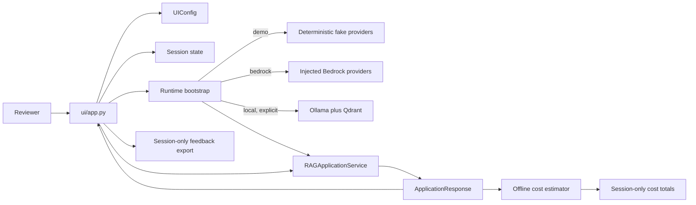

# Local Streamlit interface

The Streamlit interface is a thin local presentation layer around the existing
`RAGApplicationService`. It is intended for development, demonstrations,
review, and future deployment planning. It adds no AWS infrastructure.

## Architecture



`ui/app.py` does not call Bedrock, S3, an embedder, retriever, classifier, or
router. Bootstrap composes dependencies, and every request is sent through
`RAGApplicationService.handle`.

The package is divided by responsibility:

- `ui/app.py`: Streamlit widgets and response rendering.
- `ui/bookkeeping_page.py`: local bookkeeping upload, analysis, and explicit
  model
  action presentation.
- `ui/bootstrap.py`: demo/Bedrock dependency composition and corpus loading.
- `ui/config.py`: environment-backed validated settings.
- `ui/session.py`: bounded conversation and feedback state.
- `ui/formatting.py`: safe response, source, status, and error formatting.
- `ui/demo_corpus/`: versioned synthetic CC0 knowledge.

## Setup on Windows

From PowerShell:

```powershell
python -m venv .venv
.\.venv\Scripts\Activate.ps1
python -m pip install -r requirements.txt
python -m pip install -r requirements-dev.txt
python -m streamlit run ui/app.py
```

Demo mode is the default and requires no AWS credentials or network calls.

## Runtime modes

### Demo

Demo mode uses:

- a deterministic local keyword-hash embedding provider
- the existing in-memory cosine retriever
- deterministic fake LLM responses
- seven repository-owned synthetic Markdown documents

The corpus is loaded in filename order and tagged with the selected client and
environment. It includes S3 lake architecture, Glue and Athena
troubleshooting, IAM least privilege, PySpark transformation, monitoring, and
cost guidance.

Every document is labeled synthetic and dedicated under CC0 1.0. The corpus
contains no credentials, account IDs, customer data, commercial book material,
or LLM Zoomcamp FAQ content.

### Bedrock

Bedrock mode uses the existing `BedrockEmbeddingProvider` and
`BedrockLLMProvider`. It embeds the synthetic corpus locally into the in-memory
retriever and uses Bedrock for request embeddings and generation. These calls
may incur AWS cost.

Credentials are resolved through boto3's standard credential chain. The UI has
no credential field and never displays credentials. Before using this mode,
configure the AWS CLI, an approved environment-based credential mechanism, or
another standard boto3 provider outside Streamlit. Confirm model access,
Region, quotas, and IAM permissions.

Bedrock mode still does not use S3, a managed vector database, or execution
tools.

### Local

Local mode uses the configured Ollama chat and embedding models plus the
loopback Qdrant collection. The sidebar shows selected provider/model/collection
facts without secrets. It performs no connection check until the user clicks
**Test local connections**, and builds the inference/index dependencies only
when local mode is explicitly submitted. See
[Local Ollama and Qdrant RAG](LOCAL_VECTOR_RAG.md) for setup and isolation.

## Controls

The interface includes:

- project title and description
- query input and disabled-empty submit control
- client ID and environment selectors
- explicit demo/Bedrock/local mode selection
- conversation-history toggle and clear button
- retrieval top-k and similarity threshold
- a disabled-by-default developer source-summary toggle
- clickable example questions

Changing client or environment clears conversation and the displayed response.
Users cannot change routing approval flags or bypass application safety
controls.

The separate **Bookkeeping** page accepts one bounded local CSV. Validation,
normalization, analytics, and duplicate detection run without a model. An
approval checkbox and explicit buttons gate any configured provider call.
Account-number-like digit sequences are redacted in its tables, and category
suggestions remain advisory. See
[Private bookkeeping assistant](BOOKKEEPING_ASSISTANT.md).

The same page includes a **Bookkeeping knowledge** area for session-local,
text-based PDF ingestion. Users must classify and explicitly approve each
reference. Active general references and client-matching references can be
searched with keyword, semantic, or hybrid retrieval. The UI shows page/chunk
status, embedding status, source previews, verified citations, no-context and
conflict warnings, and non-destructive deactivation. Uploading a PDF does not
invoke Ollama or another LLM; generation occurs only after a separate approval
and button click. OCR is not included.

## Responses and sources

The response panel displays:

- answer and terminal status
- classified intent and selected route
- classifier confidence
- approval and safety-review requirements
- total latency
- model ID and token counts when available
- estimated request cost, with at least six decimal places
- warnings

The `Cost details` expander shows the model, authoritative token counts,
configured rates, input/output/cache components when applicable, total,
pricing source and effective date, and the estimate-versus-invoice disclaimer.
Unknown catalog entries or missing Bedrock usage remain visible as
`Unavailable`; the response itself still succeeds.

Approval-required responses are warnings. Safety-review responses are displayed
as errors. Stack traces and private reasoning are hidden unless
`APP_DEVELOPER_MODE=true`, which should be used only on a trusted development
machine.

Each source has an expandable panel containing its source name, document and
chunk IDs, similarity score, page or section, object key, and allowlisted
metadata. Embeddings and full retrieved documents are never displayed.

The optional development panel shows only source identifiers, locations,
scores, and aggregate retrieval diagnostics. It uses the already scoped
citations returned by the application and cannot access cross-client context.

## Conversation state

Conversation history exists only in `st.session_state`:

- user and assistant roles are preserved
- the newest configured number of messages is passed to the application
- history is reset on client or environment change
- clear conversation removes history and the displayed response
- feedback is not treated as conversation
- no file, database, S3, or browser-independent persistence is used
- cost totals are keyed by request ID, so Streamlit reruns do not duplicate
  usage
- demo tokens may be counted, but demo requests add no AWS charge

Refreshing or closing the Streamlit session can remove conversation state.

## Feedback

Thumbs-up and thumbs-down controls are shown only for completed answers. An
optional comment is bounded to 500 characters. Feedback is keyed by request ID,
so a second rating for the same response is rejected.

Feedback remains in session state and can be downloaded as deterministic JSON
or CSV. Export is an explicit local browser download; there is no server-side
database or AWS resource. Existing rating fields remain, with model ID, token
counts, estimated input/output/total costs, and pricing version added.

## Example questions

- `Design an S3-to-Glue-to-Athena pipeline.`
- `Why did my Glue job fail with an access-denied error?`
- `Write a PySpark deduplication transformation.`
- `What information do you need before designing my pipeline?`
- `Deploy my CDK stack.`
- `Delete the production data bucket.`

The deployment example returns `approval_required`. The deletion example
returns `safety_review_required`. Neither invokes embeddings, retrieval, the
LLM, or a tool after safety routing, and neither executes an AWS action.

## Configuration

`.env.example` is a reference only; no real `.env` is created or committed.
Set values in PowerShell before launching:

```powershell
$env:APP_RUNTIME_MODE = "demo"
$env:APP_DEFAULT_CLIENT_ID = "demo-client"
$env:APP_DEFAULT_ENVIRONMENT = "dev"
python -m streamlit run ui/app.py
```

| Variable | Default | Purpose |
| --- | --- | --- |
| `APP_RUNTIME_MODE` | `demo` | Explicit `demo`, `bedrock`, or `local` profile |
| `APP_LLM_PROVIDER` / `LLM_PROVIDER` | `fake` | `fake`, `bedrock`, or `ollama` |
| `APP_EMBEDDING_PROVIDER` / `EMBEDDING_PROVIDER` | `fake` | `fake`, `bedrock`, or `ollama` |
| `APP_VECTOR_STORE_PROVIDER` / `VECTOR_STORE_PROVIDER` | `memory` | `memory` or `qdrant` |
| `AWS_REGION` | `us-west-2` | Bedrock Runtime Region |
| `APP_EMBEDDING_MODEL_ID` | `amazon.titan-embed-text-v2:0` | Bedrock embedding model |
| `APP_LLM_MODEL_ID` | `anthropic.claude-3-haiku-20240307-v1:0` | Bedrock Converse model |
| `APP_DEFAULT_CLIENT_ID` | `demo-client` | Initial hard scope |
| `APP_DEFAULT_ENVIRONMENT` | `dev` | Initial lifecycle environment |
| `APP_RETRIEVAL_TOP_K` | `5` | Maximum retrieved chunks |
| `APP_MINIMUM_SIMILARITY` | `0.0` | Retrieval similarity threshold |
| `APP_MAXIMUM_CONVERSATION_MESSAGES` | `10` | Session context bound |
| `APP_DEVELOPER_MODE` | `false` | Permit local stack traces |
| `APP_PRICING_CATALOG_PATH` | bundled catalog | Reviewed offline price catalog |
| `APP_OLLAMA_URL` | `http://localhost:11434` | Loopback Ollama API |
| `APP_OLLAMA_EMBEDDING_MODEL` | `embeddinggemma` | Ollama embedding model |
| `APP_OLLAMA_CHAT_MODEL` | `qwen3:8b` | Ollama chat model |
| `APP_QDRANT_URL` | `http://localhost:6333` | Qdrant API |
| `APP_QDRANT_COLLECTION` | `dea_knowledge_embeddinggemma_v1` | Model-versioned collection |
| `APP_QDRANT_API_KEY` | empty | Optional Qdrant API key; never displayed |

`load_ui_config(..., overrides=...)` also supports programmatic local
configuration without adding another file format or dependency.
The earlier `DEA_*` names remain accepted as compatibility aliases.

## Cost estimates

Demo mode shows `$0.000000` and explicitly states that no Bedrock charge was
incurred. Bedrock mode uses actual Converse `inputTokens` and `outputTokens`;
it does not derive tokens from character counts. The current-session panel
shows requests, total input/output tokens, and estimated chargeable cost. These
values disappear with the Streamlit session and are not billing records.

> This is an application estimate, not an AWS invoice. Actual charges may
> differ by model, Region, pricing mode, caching, discounts, and AWS pricing
> changes.

See [LLM cost estimation](COST_ESTIMATION.md) for the Decimal calculation,
catalog maintenance procedure, cache limitations, and official pricing-page
reference.

## Error handling

The interface maps configuration, missing-credential, access-denied,
throttling, unavailable-model, and malformed-response failures to concise
messages. Application responses separately expose safe retrieval,
insufficient-context, and generation failure statuses. Complete prompts,
queries, documents, credentials, embeddings, and internal stack traces are not
shown during normal operation.

## Zoomcamp alignment

The interface contributes to:

- **End-to-end flow:** a user request passes through the completed
  classification, routing, retrieval, prompt, generation, and attribution
  service.
- **User interface:** reviewers can use an accessible local Streamlit
  interface with visible status and source evidence.
- **Feedback collection:** ratings and comments can be exported from the
  current session.
- **Reproducibility:** demo mode is deterministic, offline, and backed by a
  versioned synthetic corpus.
- **Demonstration readiness:** example questions cover useful answers and
  non-executing safety paths.

This does not mean the project is fully submission-ready. Final rubric review,
screenshots, walkthrough material, evaluation evidence, packaging, and
deployment decisions remain.

## Known limitations and deferred work

- No authentication, authorization, multi-user server isolation, or hosted UI.
- No feedback or conversation persistence.
- No S3-backed demo ingestion.
- No managed vector store; optional Qdrant is host-local and single-node.
- No tool execution.
- No streaming responses.
- No automated citation-to-claim verification.
- No persistent operational usage, quality, safety, or billing dashboard.

The **Offline monitoring** page reads only the committed reviewed synthetic
fixture and aggregate summary. It displays six key metrics, retrieval and
prompt comparisons, a redacted recent-event table, and a downloadable summary.
It is labeled as synthetic, does not initialize the assistant runtime, and
makes no AWS or network calls. It does not persist or copy live Streamlit
session feedback. See
[offline monitoring analysis](MONITORING_AND_FEEDBACK.md).

Future deployment and persistence require an explicit architecture and security
review before any CDK resource is added.
