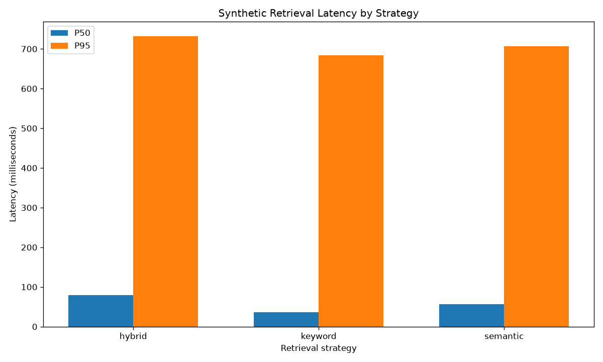
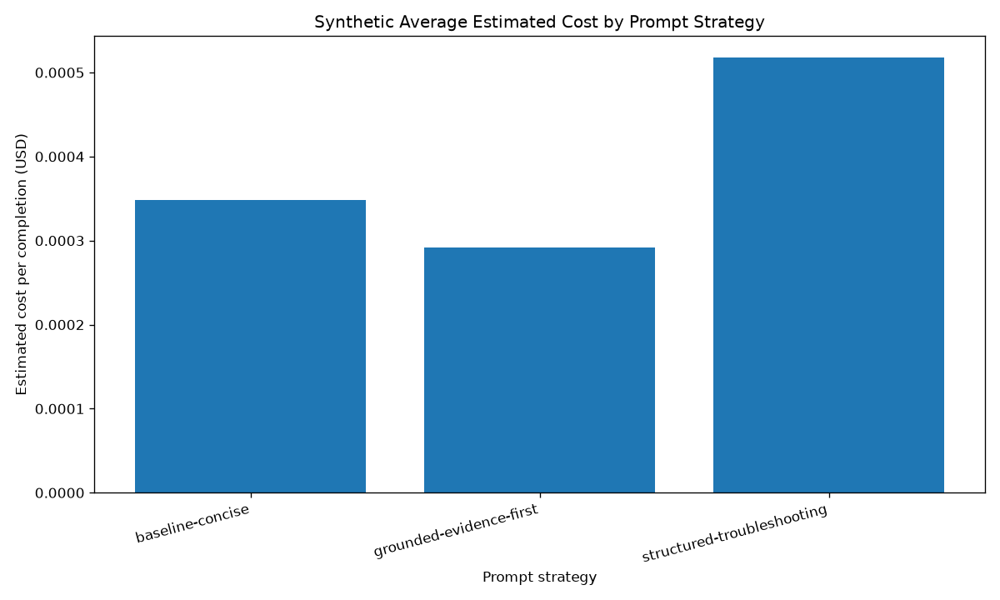
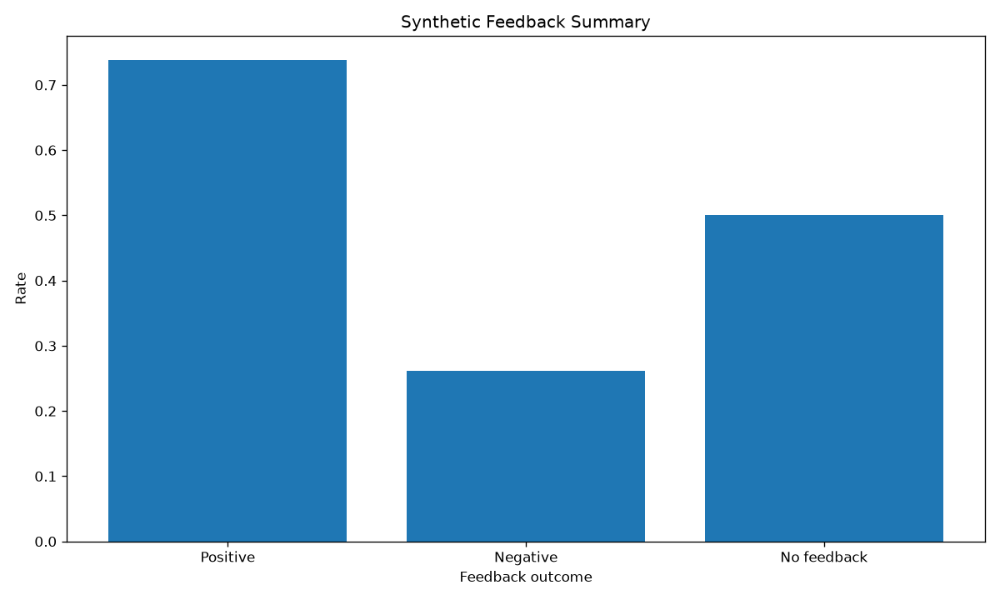
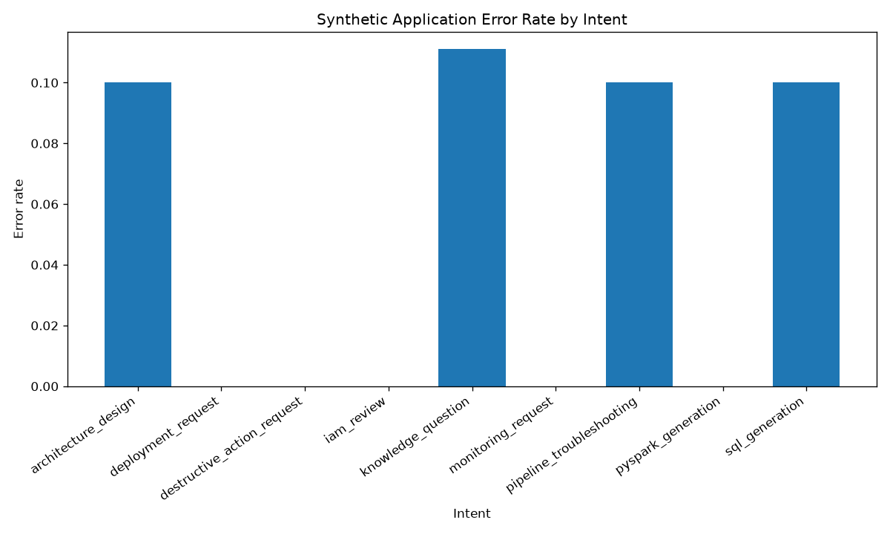
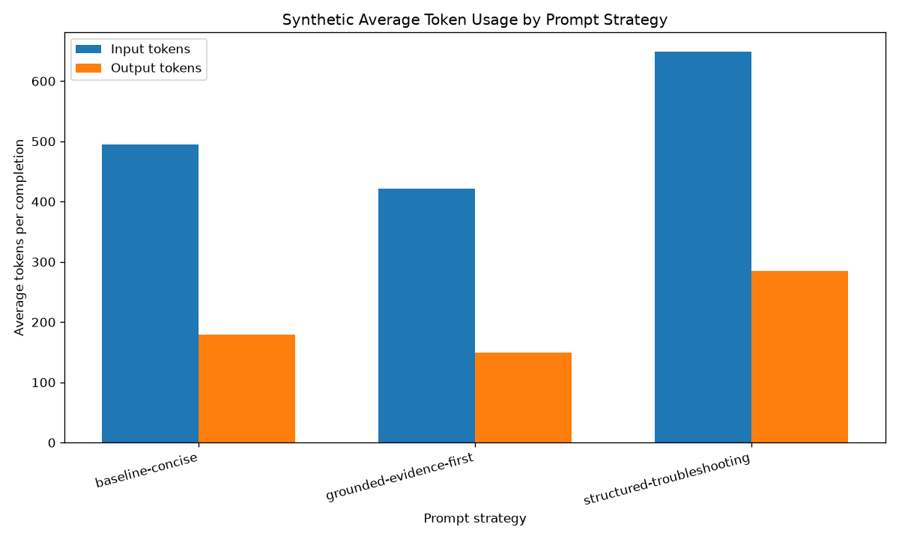

# Offline monitoring and feedback analysis

All values in this report come from deterministic **synthetic** offline events. They are demonstration evidence, not production telemetry. No AWS services were called and no provider charges were incurred.

## Provenance

- Evaluation date: `2026-07-27T00:00:00Z`
- Git commit at generation: `abae42de9f192a09ce9e16874a478019480bec04`
- Analysis version: `offline-monitoring-analysis-v1`
- Dataset versions: `synthetic-monitoring-v1`
- Event schema version: `1`
- Python: `3.12.10`
- Data classification: **synthetic**
- Estimated costs are simulated: `true`
- Raw prompts, source documents, credentials, vectors, and raw feedback text are excluded.

## Summary

| Metric | Value |
| --- | ---: |
| Requests | 84 |
| Success rate | 95.2% |
| Error rate | 4.8% |
| Feedback rate | 50.0% |
| Positive feedback | 73.8% |
| Negative feedback | 26.2% |
| Average rating (0–1) | 0.738 |
| Average latency | 402.5 ms |
| P50 latency | 225.0 ms |
| P95 latency | 2091.0 ms |
| Average retrieval latency | 118.0 ms |
| Average generation latency | 284.5 ms |
| Average input tokens | 531.8 |
| Average output tokens | 210.1 |
| Average total tokens | 741.9 |
| Simulated total estimated cost | USD 0.02452375 |
| Simulated average cost per request | USD 0.0002919494047619047619047619048 |
| Retrieval no-result rate | 9.7% |
| Citation completion proxy | 87.5% |
| Safety events | 9 |
| Approval-required events | 9 |

## Retrieval strategy comparison

| Strategy | Completions | Success | No result | Avg retrieval ms | P95 retrieval ms |
| --- | ---: | ---: | ---: | ---: | ---: |
| hybrid | 16 | 100.0% | 12.5% | 161.2 | 732.0 |
| keyword | 22 | 100.0% | 9.1% | 94.8 | 684.5 |
| semantic | 24 | 100.0% | 8.3% | 110.5 | 706.5 |

## Prompt strategy comparison

| Strategy | Completions | Complete citations | Positive feedback | Avg tokens | Simulated avg USD | P95 latency ms |
| --- | ---: | ---: | ---: | ---: | ---: | ---: |
| baseline-concise | 22 | 85.0% | 77.8% | 674.5 | 0.0003481818181818181818181818182 | 2091.0 |
| grounded-evidence-first | 17 | 87.5% | 85.7% | 570.6 | 0.0002917647058823529411764705882 | 2088.0 |
| structured-troubleshooting | 23 | 90.0% | 70.0% | 932.8 | 0.0005175543478260869565217391304 | 2188.0 |

## Charts

## Interpretation boundary

The fixture deliberately mixes positive and negative scenarios to demonstrate aggregation and grouping. Differences are illustrative, not statistically significant and not evidence of real-user behavior or production service levels. A rating of `up` is represented as 1 and `down` as 0 for the average-rating metric.
